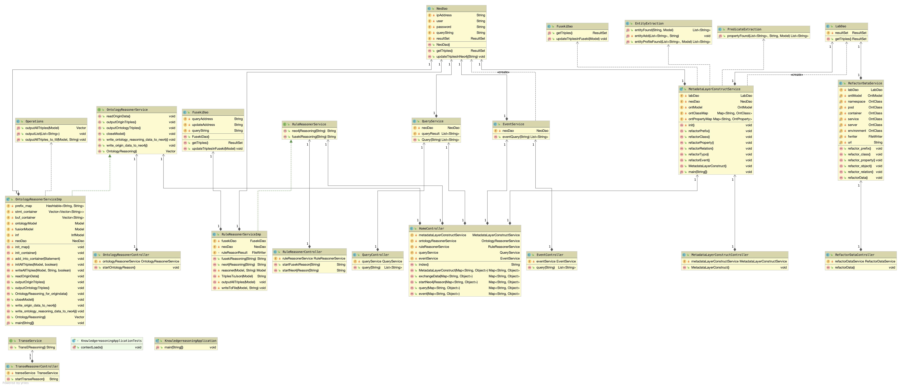

# Detailed Design

[TOC]

------

## Process Flow Design

### Metadata Layer Construct


### Ontology Reasoning


### Rule Reasoning


### Query


### Event


------

## Algorithm Design

### Metadata Layer Construct

#### Build Reason

- RDF has limited expressiveness: it lacks abstraction
- extended map implied information (knowledge reasoning)

#### Three Layer Architecture

1. **Data Layer**

   - The construction of RDF triples does not involve abstractions

     ```ttl
     @prefix owl:             <http://www.w3.org/2002/07/owl#> .
     @prefix rdf:             <http://www.w3.org/1999/02/22-rdf-syntax-ns#> .
     @prefix rdfs:            <http://www.w3.org/2000/01/rdf-schema#> .
     
     @prefix :                <http://localhost/KGns/> .
     @prefix rel:             <http://localhost/KGns/relationship/> .
     @prefix namespace_rel:   <http://namespace/10.60.38.181/> .
     @prefix pods_rel:        <http://pods/10.60.38.181/> .
     @prefix containers_rel:  <http://containers/10.60.38.181/> .
     @prefix services_rel:    <http://services/10.60.38.181/> .
     @prefix servers_rel:     <http://servers/10.60.38.181/> .
     @prefix environment_rel: <http://environment/10.60.38.181/> .
     
     @prefix namespace:       <http://localhost/KGns/Namespace/> .
     @prefix pods:            <http://localhost/KGns/Pod/> .
     @prefix containers:      <http://localhost/KGns/Container/> .
     @prefix services:        <http://localhost/KGns/Service/> .
     @prefix environment:     <http://localhost/KGns/Environment/> .
     
     ## objects
     
     <http://services/10.60.38.181/sock-shop/session-db>
         rdf:type :Service .
     
     <http://containers/10.60.38.181/sock-shop/carts-db/Network_Input_Packets>
         rdf:type :Container .
     
     <http://services/10.60.38.181/sock-shop/front-end-external/success_rate>
         rdf:type :Service .
     
     <http://containers/10.60.38.181/sock-shop/user/MEM_Usage>
         rdf:type :Container .
     
     <http://services/10.60.38.181/sock-shop/carts-db>
         rdf:type :Service .
     ```

2. **Model Layer**

   - Basic class and object concepts (RDFS)

   - Build basic classes, and relatively simple relationships

   - **Main class in Lab Knowledge Graph**

     - purely physical: server environment
     - purely logical level: namspace service
     - based on physical + logical level: pod container

     ```ttl
     ## Class
     :Namespace rdf:type owl:Class .
     :Pod rdf:type owl:Class .
     :Container rdf:type owl:Class .
     :Service rdf:type owl:Class .
     :Server rdf:type owl:Class .
     :Environment rdf:type owl:Class .
     
     
     ## ObjectProperty
     # s: Namespace
     namespace_rel:supervises
         rdf:type    owl:ObjectProperty ;
         rdfs:domain :Namespace ;
         rdfs:range  :Namespace .
     
     
     # s: Pod
     pods_rel:contains
         rdf:type    owl:ObjectProperty ;
         rdfs:domain :Pod ;
         rdfs:range  :Container .
     
     pods_rel:deployed_in
         rdf:type    owl:ObjectProperty ;
         rdfs:domain :Pod ;
         rdfs:range  :Server .
     
     pods_rel:provides
         rdf:type    owl:ObjectProperty ;
         rdfs:domain :Pod ;
         rdfs:range  :Service .
     
     
     # s: Container
     containers_rel:cc_profile
         rdf:type    owl:ObjectProperty ;	# profile for Container-Container
         rdfs:domain :Container ;
         rdfs:range  :Container .
     
     
     # s: Service
     services_rel:ss_profile
         rdf:type    owl:ObjectProperty ;	# profile for Service-Service
         rdfs:domain :Service ;
         rdfs:range  :Service .
     
     # s: Server
     servers_rel:manage
         rdf:type    owl:ObjectProperty ;
         rdfs:domain :Server ; 		# masterServer
         rdfs:range  :Server .
     
     # s: Environment
     environment_rel:has
         rdf:type    owl:ObjectProperty ;
         rdfs:domain :Environment ;
         rdfs:range  :Server .
     ```

3. **Logic Layer**

   - Complex logic involved (owl)

   - Build object properties and data properties

     ```ttl
     @prefix namespace:       <http://localhost/KGns/Namespace/> .
     @prefix pods:            <http://localhost/KGns/Pod/> .
     @prefix containers:      <http://localhost/KGns/Container/> .
     @prefix services:        <http://localhost/KGns/Service/> .
     @prefix environment:     <http://localhost/KGns/Environment/> .
     
     ## Class
     :Namespace rdf:type owl:Class .
     :Pod rdf:type owl:Class .
     :Container rdf:type owl:Class .
     :Service rdf:type owl:Class .
     :Server rdf:type owl:Class .
     :Environment rdf:type owl:Class .
     
     ## ObjectProperty
     # s: Pod
     pods_rel:contains
         rdf:type    owl:ObjectProperty ;
         rdfs:domain :Pod ;
         rdfs:range  :Container .
     
     pods_rel:deployed_in
         rdf:type    owl:ObjectProperty ;
         rdfs:domain :Pod ;
         rdfs:range  :Server .
     
     pods_rel:provides
         rdf:type    owl:ObjectProperty ;
         rdfs:domain :Pod ;
         rdfs:range  :Service .
     
     ## objects
     <http://services/10.60.38.181/sock-shop/session-db>
         rdf:type :Service .
     
     <http://containers/10.60.38.181/sock-shop/carts-db/Network_Input_Packets>
         rdf:type :Container .
     
     <http://services/10.60.38.181/sock-shop/front-end-external/success_rate>
         rdf:type :Service .
     
     
     ## relation
     <http://pods/10.60.38.181/sock-shop/shipping-65769d99d7-lmpg7>
         <http://pods/10.60.38.181/contains>    <http://containers/10.60.38.181/sock-shop/shipping> ;
         <http://pods/10.60.38.181/deployed_in> <http://server/10.60.38.181/192.168.199.34> ;
         <http://pods/10.60.38.181/provides>    <http://services/10.60.38.181/sock-shop/shipping> .
     
     <http://pods/10.60.38.181/sock-shop/catalogue-b8587c9c5-wfvkt>
         <http://pods/10.60.38.181/contains>    <http://containers/10.60.38.181/sock-shop/catalogue> ;
         <http://pods/10.60.38.181/deployed_in> <http://server/10.60.38.181/192.168.199.34> ;
         <http://pods/10.60.38.181/provides>    <http://services/10.60.38.181/sock-shop/catalogue> .
     ```

#### Key Steps

1. Read data from lab dataset.
2. Distinguish between entities.
   - operation and maintenance entities: entityType
   - state information corresponding to these operation and maintenance entities: StatusInformation
3. Set the corresponding map for each entity and relationship.
4. Refactor prefix.
5. Refactor class.
6. Refactor property.
7. Refactor relation.
8. Refactor event.


### Mechian Learning Reasoning Based on TransE

------

#### Algorithm thoughts

- Core idea :  Transforms triples into low-dimensional vectors, which we call embedding vectors. After they become vectors, many mathematical methods can be used for further processing.

  >  The original data was in triples(h, r, t)，I hope to find some algorithm that can change h，r，t to vector，for example [0.01, 0.04, 0.8, 0.32, 0.09, 0.18]，and $h+r \approx t$

  

- **target function：**$min(h,r,t) \in S\sum(h',r,t') \in S'\sum[\gamma + d(h+r,t) - d(h' + r, t')]_+$

  ​				$\gamma$: Spacing between positive and negative samples (constant)

  ​				$[x]_+$: max(0, x)

  
  
  - **Constraints：**$||h||≤1,||r||≤1,||t||≤1$，avoid overfitting

- simple idea

  >  for each entity:
>
  >  1. Firstly, the embedding vector was randomly initialized as a vector with specified dimension, and then the embedding vector was modified continuously according to the following steps to obtain the embedding vector
>
  >  2. Randomly extract b vectors from the training triad and break each triad (randomly replace the head or tail, but not simultaneously).
  >
  >  3. Then calculate the potential energy function and update h, r and t with the gradient descent algorithm

------

#### Algorithm Logic

- Randomly initialize the head entity, tail entity and relational vector, and normalize the randomly initialized vector;

- Sampling triples in the data set and entity replacement of the sampled triples to form a negative example;
  - The vector representation of entities and relationships is continuously optimized by stochastic gradient descent.

  **Algorithm**：
  
  

**Implementation**：

  - call `_init_()` to initialize triples, vector dimensions, distance calculation formulas, etc.


  - call`initialize(self)`to initialize the vector.

    1.Randomly value each dimension of each entity and relation through the function `uniform(-6/math.sqrt(self.k),6/math.sqrt(self.k))`.

      2.Normalize the vector using`norm()`.

  - call`train(self,cI)` for cyclic training (cI: training times).

    1. The triples are randomly sampled by `sample()` and`Sbatch[]` is stored.

    2. Call the function `getCorruptedTriplet(self,triplet)` to break each triplet in the `Sbatch[]`and store the original triplet and the broken triplet into the Tbatch[].
       Breaking process: replace head or trail randomly and make sure the entity before and after replacing is not the same, that is, the triplet before and after breaking is not the same.

       Note: head and trail cannot be replaced at the same time, otherwise there is no comparison.

       1. Call`update(self,Tbatch)` to fix triples.

          For all triplet pairs in `Tbatch[]`, the L1 or L2 formula (Euclid/Huffman distance formula) is used to calculate the distance and obtain the loss. `(self.margin + distTriplet - distCorruptedTriplet)`

          For the triplet pairs in Tbatch, calculate the gradient $2*learingRate*(h+r-t)$, and update the triplet pairs according to the gradient to ensure that the distance between the original triplet d is smaller and smaller while the distance between the broken triplet d is larger and larger.

------

  #### Key Problems

  ##### 1. How to get wrong triplet？

  Replace head or trail randomly and make sure that the entity before and after replacement is not the same.

  In order to avoid the situation that the generated negative example actually exists in the knowledge base, we can filter the generated negative example. If it is a positive example in the knowledge base, we will not treat it as a negative example, but regenerate a negative example.

  > **why can't the head and tail be broken at the same time?**
  >
  > There is no contrast.

  ##### 2. How to correct triples based on gradient descent？

  https://blog.csdn.net/weixin_42348333/article/details/89598144

  **Potential energy function：**For the correct triplet, the lower the potential energy, the better;For the wrong triad, the higher the potential energy, the better.

  >  There are two representations of potential energy functions (distances)
  >
  >  - Euclidean norm：
  >
  >   $$ f(h,r,t) = ||h+r-t||_2 $$
  >
  >   $$ ||\textbf{x}||*2 =\sqrt{\sum*{i=1}^Nx_i^2} $$
  >
  >  - Euclidean norm: sum of squares of the absolute value of a vector.

  ##### 3. The use of validation and test

  Validation: a set of validations, which is used to validate and adjust the trained model to select the best model.

  Test: test set to test the model selected by the verification set.

  Replace the header entity of the triplet with each entity in the dictionary in turn. Firstly, the distance of these substitution tuples is calculated by the model, and then it is arranged in ascending order. Finally, the rank of the correct entity is stored. Repeat the process, replacing the removed head with the removed tail. Record the average of the predicted rankings and the percentage of hits@10, which is the correct entity in the top 10.

  ##### 4. How to test？

  Assuming there are n entities in the whole knowledge base, the evaluation process is as follows:

  - Replacing the head or tail entities in a correct triplet a with all the other entities in the entire knowledge base will result in n triples
  - Calculate the energy value of the above n triples respectively. In transE, calculate the value of h+r-t.This gives us n energy values corresponding to the n triples above.
  - Sort the above n energy values in ascending order.
  - Record the sequence number of the sorted energy value of triplet a.
  - Repeat the process for all correct triples.
  - The ordinal number of the ordered energy value of each correct triplet is averaged, and the resulting value is called the Mean Rank.
  - Calculate the proportion of the sequence number less than 10 after the energy ordering of the correct triplet. The value obtained is called Hits@10.

  **Two indicators：**

  - Mean Rank: measures the overall effect of the algorithm on all triples (the smaller the better)
  - Hits@10: measures the degree to which the algorithm works well(the bigger the better)

  **Improvements：**

  There is an unreasonableness in the above process: the triplet obtained after replacing the head or tail entity of a correct triplet with another entity may also be correct, and after calculating and ordering the energy of each triplet, the energy of such a correct triplet may be prior to that of a. But the basic evaluation process mentioned above does not take this into account. Therefore, the results obtained by the above basic evaluation process are called Raw Mean Rank and Raw Hits@10, and the results obtained by the improved method are called Filtered Mean Rank and Filtered Hits@10.

  In order to better evaluate the embedding quality, we improved the above methods.

  - Replace the head or tail entities in a correct triplet a with all the other entities in the entire knowledge base, that is, n triples will be generated.
  - Calculate the energy value of the above n triples respectively. In transE, calculate the value of h+r-t. This gives us n energy values corresponding to the n triples above.
  - Sort the n energy values in ascending order.
  - Record the sequence number k after the energy value of triplet a is sorted.
  - If m of the triples corresponding to the first k-1 energies are also correct, then the sequence number of a is changed to k-m.
  - Repeat the process for all correct triples.
  - Average the ordinal number of the ordered energy value of each correct triplet, and the resulting value is called Filtered Mean Rank.
  - Calculate the proportion of the ordered energy of the correct triplet whose sequence number is less than 10, and the resulting value is called Filtered Hits@10.

------

## Class Design




---

### LabDao

com.tongji.knowledgereasoning.dao

_public class **LabDao** 

Used to get the lab data.

#### Fields

| Modifier and Type  | Field     | Description              |
| :----------------- | :-------- | :----------------------- |
| *public ResultSet* | resultSet | the user type identifier |

#### Methods

> getTriples

* public ResultSet getTriples() *

Get the lab data.

**returns**

 the lab data

**parameters**

none


### NeoDao

com.tongji.knowledgereasoning.dao

_public class **NeoDao** 

Used to get or update the neo4j data.

#### Fields

| Modifier and Type   | Field       | Description            |
| :------------------ | :---------- | :--------------------- |
| *public String*     | resultSet   | neo4j ip address       |
| *private String*    | user        | neo4j user name        |
| *private String*    | password    | neo4j password         |
| *private String*    | queryString | neo4j query expreesion |
| *private ResultSet* | resultSet   | neo4j query result     |

#### Constructors

>NeoDao

Generate the neo4j instance by ip,user,password.

**parameters**
-id: the id of the student

#### Methods

> getTriples

* public ResultSet getTriples()*

Get the lab data.

**returns**

 the lab data

**parameters**

none

#### Methods

> updateTriplesInNeo4j

* public void updateTriplesInNeo4j(String ttlInsert) *

update the neo4j data.

**returns**

none

**parameters**

String ttlInsert


### MetadataLayerConstructService

com.tongji.knowledgereasoning.service

_public class MetadataLayerConstructService

Used to construct metadata layer.

#### Fields

| Modifier and Type                  | Field          | Description           |
| :--------------------------------- | :------------- | :-------------------- |
| *private LabDao*                   | labDao         | lab database instance |
| *private NeoDao*                   | neoDao         | neo4j instance        |
| *private OntModel*                 | ontModel       | jena model            |
| *private Map<String, OntClass>*    | ontClassMap    | class map             |
| *private Map<String, OntProperty>* | ontPropertyMap | property map          |

#### Methods

> init

* public void init() *

Initialize ontModel, ontClass, ontPropertyMap.

**returns**

none

**parameters**

none

> refactorPrefix

* public void refactorPrefix() *

refactor data prefix.

**returns**

none

**parameters**

none

> refactorClass

* public void refactorClass() *

refactor class of the lab data.

**returns**

none

**parameters**

none

> refactorProperty

* public void refactorProperty() *

refactor property of the class.

**returns**

none

**parameters**

none

> refactorRelation

* public void refactorRelation() *

refactor relation between the class.

**returns**

none

**parameters**

none

> MetadataLayerConstruct

* public void MetadataLayerConstruct() *

construct metadata layer and write data to neo4j.

**returns**

none

**parameters**

none


### OntologyReasonerServiceImp

com.tongji.knowledgereasoning.service

_public class MetadataLayerConstructService implements OntologyReasonerService

Ontology reasoning.

#### Fields

| Modifier and Type           | Field          | Description                                         |
| :-------------------------- | :------------- | :-------------------------------------------------- |
| *Hashtable<String, String>* | prefix_map     | a map to store prefix                               |
| Vector<Vector<String>>      | stmt_container | statement container                                 |
| *Vector<String>*            | buf_container  |                                                     |
| *Model*                     | ontologyModel  | create a model for ontology                         |
| *Model*                     | fusionModel    | create a model to Merge ontology with instance data |
| *InfModel*                  | inf            | model after merging                                 |
| *NeoDao*                    | neoDao         | neo4j instance                                      |

#### Methods

> init_container

* public void init_container() *

Initialize the result container and classify Class,Object Property object,relation.

**returns**

none

**parameters**

none

> add_into_container

* public void add_into_container(Statement stmt) *

Filter the triples and add them to the result container.

**returns**

none

**parameters**

Statement stmt

> initAllTriples

* public void initAllTriples(Model model, boolean with_filter) *

Take out the triples in the model one by one and add them to the container as required.

**returns**

none

**parameters**

model: ontology model

with_filter: Whether to enable filters

> writeAllTriples

* public void writeAllTriples(Model model, String filename, boolean with_filter) *

Write triples to file.

**returns**

none

**parameters**

model: ontology model

filename: file path

with_filter: Whether to enable filters

> readOriginData

* public void readOriginData() *

Read origin data.

**returns**

none

**parameters**

none

> OntologyReasoning

* public void OntologyReasoning()*

Ontology reasoning.

**returns**

none

**parameters**

none

**throws**

FileNotFoundException


### RuleReasonerServiceImp

com.tongji.knowledgereasoning.service

_public class MetadataLayerConstructService implements OntologyReasonerService

Ontology reasoning.

#### Fields

| Modifier and Type | Field            | Description     |
| :---------------- | :--------------- | :-------------- |
| *NeoDao*          | neoDao           | neo4j database  |
| FileWriter        | ruleReasonResult | rusult file     |
| FusekiDao         | fusekiDao        | fuseki database |

#### Methods

> neo4jReasoning

* public String neo4jReasoning(String rules)*

Rule reasoning based on neo4jdatabase.

**returns**

triples: reasoning result

**parameters**

rules: rules expression

> fusekiReasoning

* public String fusekiReasoning(String rules)*

Rule reasoning based on fuseki database.

**returns**

triples: reasoning result

**parameters**

rules: rules expression


### TransE

class TransE

TransE reasoning.

#### Fields

| Modifier and Type | Field        | Description      |
| ----------------- | :----------- | :--------------- |
| *List*            | entityList   | entity           |
| *List*            | relationList | relation         |
| *List*            | tripleList   | triples          |
| *int*             | margin       | margin           |
| **                | learningRate | learning rate    |
| *int*             | dim          | Vector dimension |
| *boolean*         | L1           | distance choice  |

#### Methods

> init

* def __init__(self, entityList, relationList, tripleList, margin, learingRate, dim, L1)

initialize parameters.

**returns**

none

> initialize

* def initialize(self)

initialize vectors.

**returns**

none

> transE

* def transE(self,cI)

transE reasoning .

**returns**

none

> getCorruptedTriplet

* def getCorruptedTriplet(self,triplet)

training triplets with either the head or tail replaced by a random entity (but not both at the same time)

**parameters**

triplet: Sbatch

**returns**

corruptedTriplet

> update

* def update(self, Tbatch)

update triples while reasoning.

**returns**

none

**parameters**

Tbatch: List of tuple pairs (original triples, broken triples): {((h, r, t), (h ', r, t'))}

> norm

* def norm(list)

Normalize.

**returns**

Vectors of the squared sum of vectors

**parameters**

vector list


### QueryService

com.tongji.knowledgereasoning.service

_public class QueryService

Using sparql to query event.

#### Fields

| Modifier and Type | Field       | Description    |
| :---------------- | :---------- | :------------- |
| *NeoDao*          | neoDao      | neo4j database |
| *List<String>*    | queryResult | query result   |

#### Methods

> Query

* public List<String> Query(String query)*

Rule reasoning based on neo4jdatabase.

**returns**

query result

**parameters**

query: query expression


### EventService

com.tongji.knowledgereasoning.service

_public class EventService

Using ontology reasoning and rule reasoning to get events.

#### Fields

| Modifier and Type | Field  | Description    |
| ----------------- | :----- | :------------- |
| *NeoDao*          | neoDao | neo4j database |

#### Methods

> eventQuery

* public List<String> eventQuery(String service)*

Using ontology reasoning and rule reasoning to get events.

**returns**

event list

**parameters**

service


