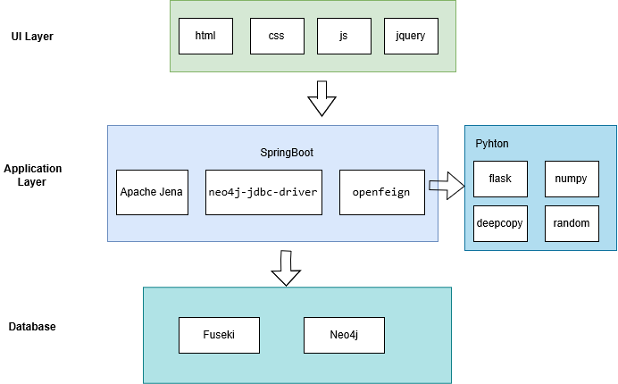
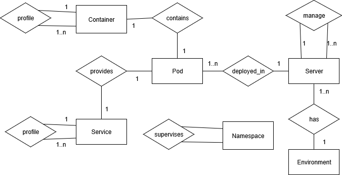

# High Level Design

[TOC]

------

## Prototype Design

**The UI design of the project**

Since our project focused on algorithms, we didn't pay much attention on the user interface side, just using the various knowledge reasoning services we provided through the user interface.


------

## Business Architecture


------

## Technology Architecture




------

## Deployment Topology


------

## Data Models

### Entity-Relation Design 



### Database Design 

**Class**

| name | type  |
| ---- | ----- |
| Pod  | Class |

| name      | type  |
| --------- | :---- |
| Container | Class |

| name    | type  |
| ------- | ----- |
| Service | Class |

| name   | type  |
| ------ | ----- |
| Server | Class |

| name        | type  |
| ----------- | ----- |
| Environment | Class |

| name       | type  |
| ---------- | ----- |
| Namespcace | Class |

**prefix**

| name      | prefix                           |
| --------- | -------------------------------- |
| namespace | http://localhost/KGns/Namespace/ |

| name | prefix                     |
| ---- | -------------------------- |
| pods | http://localhost/KGns/Pod/ |

| name       | prefix                           |
| ---------- | -------------------------------- |
| containers | http://localhost/KGns/Container/ |

| name     | prefix                    |
| -------- | ------------------------- |
| services | http://pods/10.60.38.181/ |

| name        | prefix                             |
| ----------- | ---------------------------------- |
| environment | http://localhost/KGns/Environment/ |

| name     | prefix                    |
| -------- | ------------------------- |
| pods_rel | http://pods/10.60.38.181/ |

| name     | prefix                    |
| -------- | ------------------------- |
| pods_rel | http://pods/10.60.38.181/ |

| name           | prefix                          |
| -------------- | ------------------------------- |
| containers_rel | http://containers/10.60.38.181/ |

| name         | prefix                        |
| ------------ | ----------------------------- |
| services_rel | http://services/10.60.38.181/ |

| name        | prefix                       |
| ----------- | ---------------------------- |
| servers_rel | http://servers/10.60.38.181/ |

| name          | prefix                         |
| ------------- | ------------------------------ |
| namespace_rel | http://namespace/10.60.38.181/ |

| name            | prefix                           |
| --------------- | -------------------------------- |
| environment_rel | http://environment/10.60.38.181/ |

**Object Property**

| Object Property       | domain | range  |
| --------------------- | ------ | ------ |
| pods_rel: deployed_in | Pod    | Server |

| Object Property    | domain | range     |
| ------------------ | ------ | --------- |
| pods_rel: contains | Pod    | Container |

| Object Property    | domain | range   |
| ------------------ | ------ | ------- |
| pods_rel: provides | Pod    | Service |

| Object Property     | domain | range  |
| ------------------- | ------ | ------ |
| servers_rel: manage | Server | Server |

| Object Property      | domain      | range  |
| -------------------- | ----------- | ------ |
| environment_rel: has | Environment | Server |

| Object Property           | domain    | range     |
| ------------------------- | --------- | --------- |
| namespace_rel: supervises | Namespace | Namespace |

| Object Property         | domain    | range     |
| ----------------------- | --------- | --------- |
| containers_rel: profile | Container | Container |

| Object Property       | domain  | range   |
| --------------------- | ------- | ------- |
| services_rel: profile | Service | Service |


------

## Interface Specifications

### *knowledge-reasoning/metadata-layer-construct*   

#### Description

Construct metadata layer.

| Request Method | POST     |
| -------------- | -------- |
| Authorization  | Required |

#### Parameters

none

#### Responses

| Code | Description                         | Schema        |
| :--: | :---------------------------------- | :------------ |
| true | Successful construct metadata layer | flag : string |

#### Request Sample

```
knowledge-reasoning/metadata-layer-construct
```

#### Response Sample

```
{
	"flag": "true"
}
```


### *knowledge-reasoning/ontology-reasoning*   

#### Description

Ontology reasoning based on metadata layer.

| Request Method | POST     |
| -------------- | -------- |
| Authorization  | Required |


#### Parameters

| Name |   Located in   | Description                                               | Required | Schema |
| :--: | :------------: | :-------------------------------------------------------- | :------: | :----- |
| flag | metadata layer | judge whether metadata layer is built successfully or not |   Yes    | String |

#### Responses

|      Code       | Description         | Schema                    |
| :-------------: | :------------------ | :------------------------ |
| fresh_knowledge | Successful response | *fresh_knowledge* : Array |

#### Request Sample

```
knowledge-reasoning/ontology-reasoning
```

#### Response Sample

```
{
    "fresh_knowledge": [
        "[http://pods/10.60.38.181/sock-shop/catalogue-db-99cbcbb88-wl52p, http://pods/10.60.38.181/provides, http://services/10.60.38.181/sock-shop/catalogue-db]",
        "[http://pods/10.60.38.181/sock-shop/shipping-65769d99d7-lmpg7, http://pods/10.60.38.181/provides, http://services/10.60.38.181/sock-shop/shipping]",
        "[http://pods/10.60.38.181/sock-shop/orders-6496fcd6f7-qcmj7, http://pods/10.60.38.181/provides, http://services/10.60.38.181/sock-shop/orders]",
        "[http://pods/10.60.38.181/sock-shop/carts-648d5f498d-n8hzn, http://pods/10.60.38.181/provides, http://services/10.60.38.181/sock-shop/carts]"
    ]
}
```


### *knowledge-reasoning/rule-reasoning*   

#### Description

Rule reasoning based on metadata layer.

| Request Method | POST     |
| -------------- | -------- |
| Authorization  | Required |


#### Parameters

|      Name       |    Located in    | Description                        | Required | Schema |
| :-------------: | :--------------: | :--------------------------------- | :------: | :----- |
| rule_expression | startNeo4jReason | rule reasoning based on rule input |   Yes    | String |

#### Responses

|       Code       | Description         | Schema                     |
| :--------------: | :------------------ | :------------------------- |
| reasoning_result | Successful response | *reasoning_result* : Array |

#### Request Sample

```
knowledge-reasoning/rule-reasoning

[rule1: (?X <http://pods/10.60.38.181/provides> ?Y) -> (?X <http://10.60.38.181/KGns/relates> ?Y)]
[rule2: (?X <http://10.60.38.181/KGns/relates> ?Y) (?X <http://pods/10.60.38.181/deployed_in> ?Z) -> (?Z <http://10.60.38.181/KGns/relates> ?Y)]
[rule3: (?X <http://10.60.38.181/KGns/relates> ?Y) (?X <http://pods/10.60.38.181/contains> ?Z) -> (?Z <http://10.60.38.181/KGns/relates> ?Y)]
[rule4: (?Y <http://10.60.38.181/KGns/relates> ?X) (?Z <http://event/10.60.38.181/inject> ?Y) -> (?Z <http://10.60.38.181/KGns/effects> ?X)]
```

#### Response Sample

```
{
    "reasoning_result": "[{ \"predicate\":\"http://10.60.38.181/KGns/relates\",\"subject\":\"http://pods/10.60.38.181/sock-shop/shipping-65769d99d7-lmpg7\",\"object\":\"http://services/10.60.38.181/sock-shop/shipping\
    }]"
}
```


### *knowledge-reasoning/query*   

#### Description

Query for the event which make service fail.

| Request Method | POST     |
| -------------- | -------- |
| Authorization  | Required |


#### Parameters

|       Name       | Located in | Description                | Required | Schema |
| :--------------: | :--------: | :------------------------- | :------: | :----- |
| query_expression |   query    | query based on query input |   Yes    | String |

#### Responses

|     Code     | Description         | Schema                 |
| :----------: | :------------------ | :--------------------- |
| query_result | Successful response | *query_result* : Array |

#### Request Sample

```
knowledge-reasoning/query

PREFIX pods_rel: <http://pods/10.60.38.181/>
SELECT * 
{ <http://services/10.60.38.181/sock-shop/orders>  ^pods_rel:provides / (pods_rel:deployed_in* | pods_rel:contains* ) ?o .
}
```

#### Response Sample

```
{
    "query_result": [
        "http://pods/10.60.38.181/sock-shop/orders-6496fcd6f7-l9rmn",
        "http://server/10.60.38.181/192.168.199.32",
        "http://pods/10.60.38.181/sock-shop/orders-6496fcd6f7-l9rmn",
        "http://containers/10.60.38.181/sock-shop/orders",
        "http://pods/10.60.38.181/sock-shop/orders-6496fcd6f7-fqnjt",
        "http://server/10.60.38.181/192.168.199.33",
        "http://pods/10.60.38.181/sock-shop/orders-6496fcd6f7-fqnjt",
        "http://containers/10.60.38.181/sock-shop/orders",
        "http://pods/10.60.38.181/sock-shop/orders-6496fcd6f7-zt6zq",
        "http://server/10.60.38.181/192.168.199.32"
    ]
}
```


### *knowledge-reasoning/event*

#### Description

Reasoning specifies the cause of service failure.

| Request Method | POST     |
| -------------- | -------- |
| Authorization  | Required |


#### Parameters

|  Name   | Located in | Description    | Required | Schema |
| :-----: | :--------: | :------------- | :------: | :----- |
| service |   event    | faulty service |   Yes    | String |

#### Responses

|  Code  | Description         | Schema           |
| :----: | :------------------ | :--------------- |
| reason | Successful response | *reason* : Array |

#### Request Sample

```
knowledge-reasoning/query

PREFIX pods_rel: <http://pods/10.60.38.181/>
SELECT * 
{ <http://services/10.60.38.181/sock-shop/orders>  ^pods_rel:provides / (pods_rel:deployed_in* | pods_rel:contains* ) ?o .
}
```

#### Response Sample

```
{
    "reason": [
        "http://event/10.60.38.181/5fc29fffcb31dc41",
        "http://event/10.60.38.181/a01e44a6f230c7b8",
        "http://event/10.60.38.181/464dd12e11c7d130",
        "http://event/10.60.38.181/c6430ff37ed2b615"
    ]
}
```

