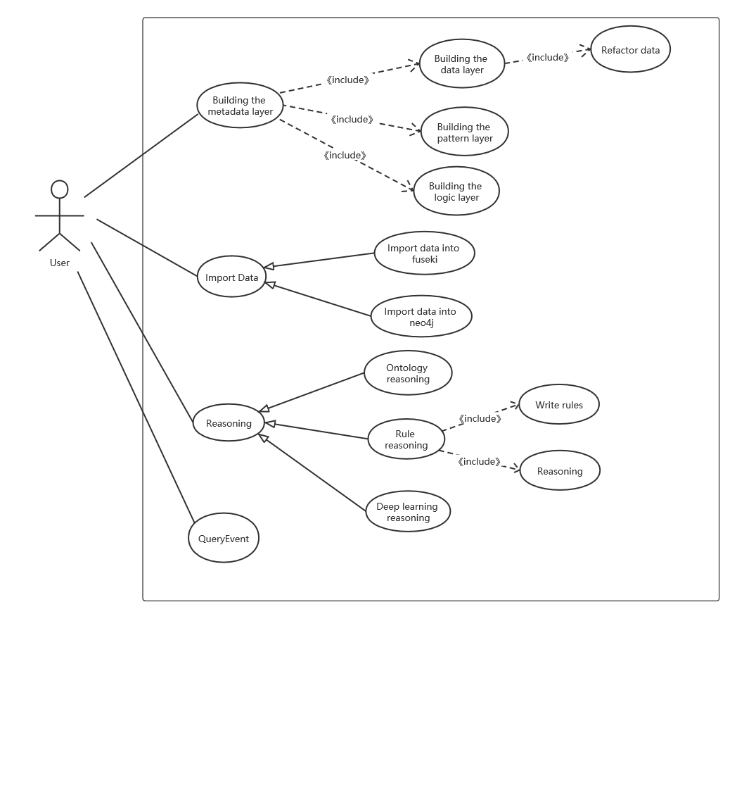
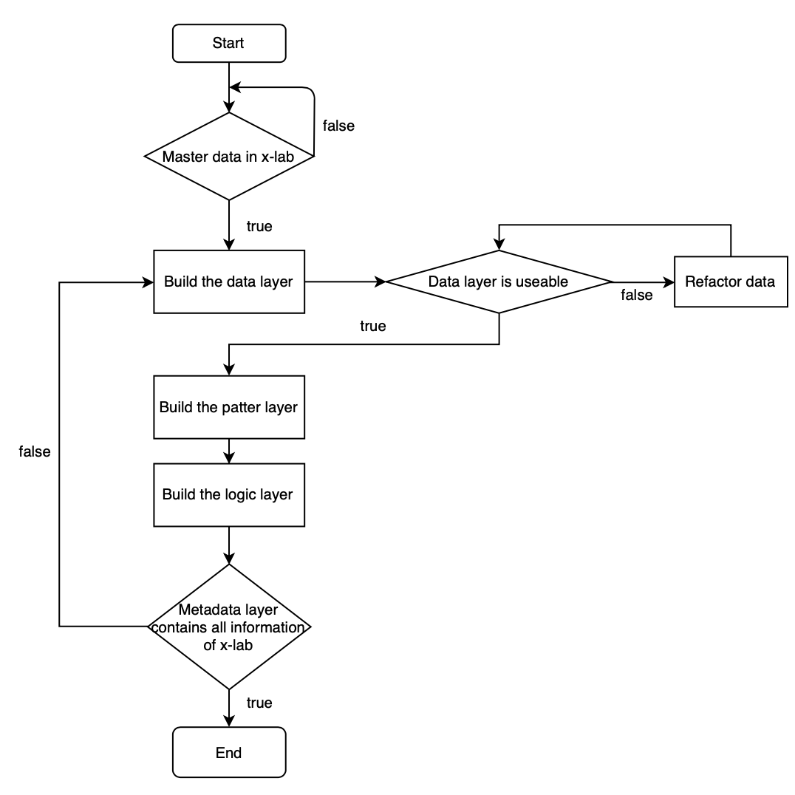
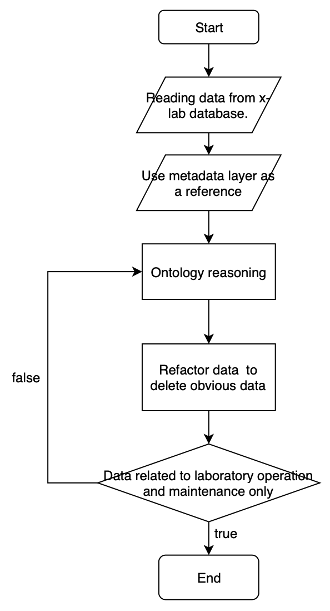

# Requirement Specification (需求规约)

[TOC]

------

## Project Introduction (项目介绍)

### Background

**Knowledge Graph** is a kind of structured data processing method, which involves a series of technologies such as knowledge extraction, representation, storage and retrieval. From the origin, it is the fusion of knowledge representation and reasoning, database, information retrieval, natural language processing and other technologies.

**Operation and Maintenance** generally refers to the maintenance of network hardware and software established by large organizations, among which the traditional Operation and Maintenance refers to IT Operation and Maintenance. Operations and maintenance are important and extensive responsibilities for the entire software development life cycle, failures can occur at any time, and the value of operations and maintenance is becoming increasingly important because of the frequent iteration of business applications.

However, in the face of massive monitoring data and huge distributed system, all kinds of operation and maintenance subjects have their own characteristics and rules, but also interrelated, which increases the difficulty of operation and maintenance decision-making, operation and maintenance knowledge graph arises at the historic moment. Combined operations and knowledge graph, let the knowledge graph offline mining operations history data, establishing all kinds of portraits, tease out all kinds of high level of knowledge, operations staff have already been good operations using data sets and knowledge graph to make decisions, not only reduce the operations staff workload, and improve the operational efficiency and accuracy.

Due to the complexity of the distributed system, once a fault occurs at a certain location, a series of service failures will result. However, simply repairing the affected service cannot fundamentally solve the problem, and the root cause of the fault needs to be located and repaired. In the operation and maintenance knowledge graph, knowledge reasoning can deduce the key factors that affect the abnormal service, and then quickly locate the root cause of the fault, so as to quickly recover the affected service and reduce the loss caused by the service failure.

This project focuses on knowledge reasoning, involving knowledge representation, storage and retrieval, not event extraction or relational extraction. Knowledge Reasoning is the process of obtaining new Knowledge from existing Knowledge based on specific rules and constraints.

### Prupose of the project

1. Construct the ontology layer of the knowledge graph, so as to improve the structure of the knowledge graph.
2. Transmit self-defined rules, obtain reasoning results based on the rules, and write the newly discovered knowledge into the database.
3. Perform ontology reasoning on knowledge graphs and write newly discovered knowledge into the database.
4. Make deep learning-based reasoning on knowledge graph and write newly discovered knowledge into the database.
5. Import data from fuseki into neo4j and establish an intermediate layer to eliminate the influence of different knowledge repositories.

### Target Users

- Operation and Maintenance Engineer
- Operations staff
- Members in x-lab

### Boundary of the project

- **This project will do:**
  - Build the metadata layer.
  - Rule reasoning.
  - Ontology reasoning
  - Deep learning-based reasoning.
  - Import data from fuseki into neo4j.
- **This project won't do:**
  - Origin data built in knowledge graph.
  - Whether the failure is reasonable.

------

## Use Case Analysis

### Use Case: _Building the Metadata Layer_

#### Description

Build the metadata layer to improve the structure of knowledge graph. The metadata layer contains data layer, pattern layer and logic layer. And refactoring of the metadata is also needed in building the metadata layer use case.

#### Participants

First of all, users who use our knowledge reasoning system should building the metadata layer.

Main system of our knowledge reasoning project will attend building the metadata layer use case.

#### Pre-condition (Optional)

- Building knowledge graph project is finished.
- All network hardware and software in x-lab are clear.

#### Post-condition (Optional)

- The metadata layer will complete.
- Knowledge graph will be more structured.
- Use the metadata layer to do reasoning.

#### Process Flow

1. Master all the hardware and software in x-lab.
2. Building the data layer.
   - Refactor of the data built in the data layer
3. Building the pattern layer.
4. Building the logic layer.
5. Repeated iteration of 2~4.
6. Reviewing throughout the process.

#### Exceptions (Optional)

- We should find some way to confirm metadata layer is completed which means that it contain all information of x-lab.

  > Solution: By randomly sampling the database and knowledge map, our ontology layer contains samples whose reliability meets the project's general criteria.

- The raw data layer is not always useable.

  > According to the structure of the data, we use several ways to refactor the raw data in order to satisfy the data requirement in the knowledge reasoning project.

### Use Case: _Ontology Reasoning_

#### Description

Ontology reasoning is carried out on the knowledge graph and the newly discovered knowledge is written into the database. This use case plays a significant role in perfect knowledge in x-lab because we cannot find all knowledge artificially.

#### Participants

Users who use our knowledge reasoning system can use ontology reasoning to perfect his or her own knowledge database.

#### Pre-condition (Optional)

- The metadata layer is built successfully.
- The knowledge is imported from database in x-lab.

#### Post-condition (Optional)

- Newly discovered knowledge will be written into the database.

#### Process Flow

1. Reading data from x-lab database.
2. Use metadata layer as a reference.
3. Ontological reasoning of the operation and maintenance data.
4. Refactor to the data to delete obvious data and retain data related to laboratory operation and maintenance only.

#### Exceptions (Optional)

- Ontology reasoning yields a lot of new data that is obvious and not useful for later use.

  > Refactor all the data after ontology reasoning. Only data related to laboratory operation and maintenance will be retained.

------

### Use Case: _Rule Reasoning_

#### Description

Rule reasoning is carried out on the knowledge graph and the reasoning result based on rules will return to users. This use case plays a significant role in perfect knowledge in x-lab because we can use it to find or write new knowledge to the database.

#### Participants

Users who use our knowledge reasoning system.

#### Pre-condition (Optional)

- The knowledge is imported from database in x-lab.
- User enters the rules.

#### Post-condition (Optional)

- Konwledge based on rules will be find and return to users.

#### Process Flow
1. User enters rules.
2. Reading data from x-lab database.
3. Start rule reasoning based on the rules user entered.
4. Write reasoning result into database.
3. Return rule reasoning result to users.

#### Exceptions (Optional)

- Rule reasoning won't get any knowledge if the rules user entered are incorrectly.
  

### Use Case: _Deep Learning Reasoning——TransE Reasoning_

#### Description

TransE reasoning is carried out on the knowledge graph and the newly discovered knowledge is written into the database.This usecase plays a significant role in perfect knowledge in x-lab because we cannot find all knowledge artificially.

#### Participants

Users who use our knowledge reasoning system.

#### Pre-condition (Optional)

- The knowledge is imported from database in x-lab.

#### Post-condition (Optional)

- Newly discovered knowledge will be written into the database.

#### Process Flow

1. Reading data from x-lab database.
2. Start transe reasoning to get new kowledge.
3. Write the new data to the database.

- TransE reasoning yields some new data that is incorrectly.

  > Modify train parameters to get different models, valid and test these models to get the best model.
 

### Use Case: _Query Event_

#### Description

Query Event is carried out on the knowledge graph and the query result will return to users. This use case plays a significant role in perfect knowledge in x-lab because we can use it to find failure components.

#### Participants

Users who use our knowledge reasoning system can use the query usecase to get the failure components of the knowledge database.

#### Pre-condition (Optional)

- The knowledge is imported from database in x-lab.

#### Post-condition (Optional)

- Failure component will be find and return to users.

#### Process Flow

1. User enters query  statement.
2. Reading data from x-lab database.
3. Start query operation.
4. Return query result to users.

