# Detailed Design Specification

## Process Flow Design

#### Use Case：CPU Fault Inject

***
#### Use Case：Memory Fault Inject

***
#### Use Case：Disk Fault Inject

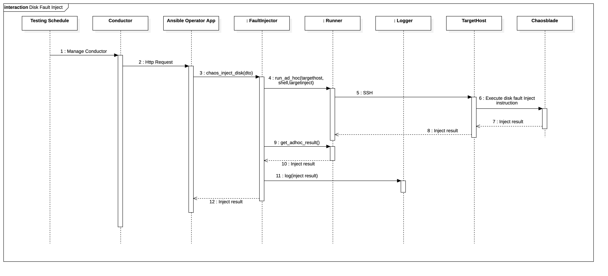

***
#### Use Case：Network Fault Inject

***
#### Use Case：Kubernetes-Service Fault Inject

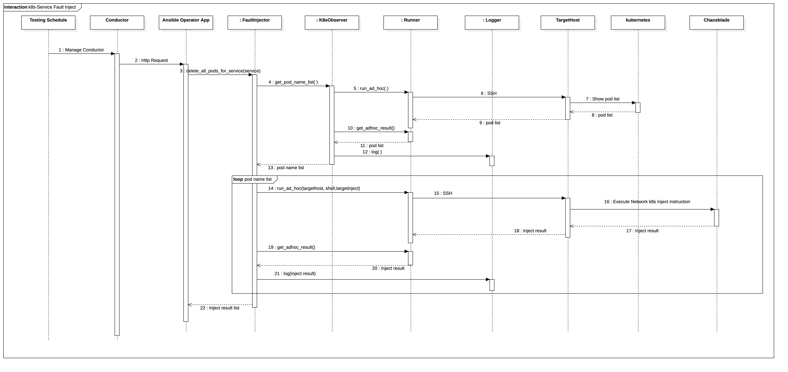

***
#### Use Case：Kubernetes-Pod Fault Inject

***

#### Use Case：Single-point Fault Recovery
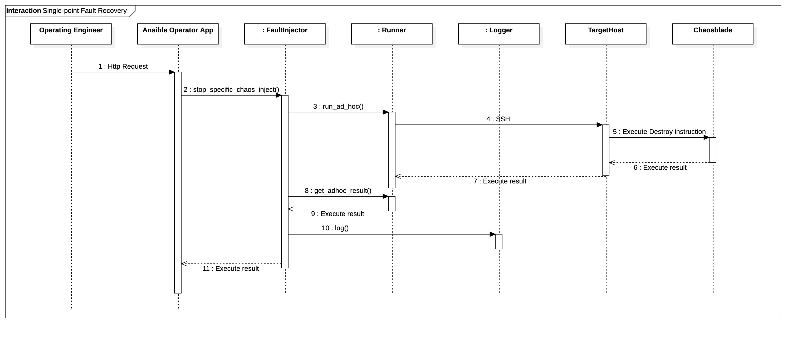
***

#### Use Case：Multi-point Fault Recovery
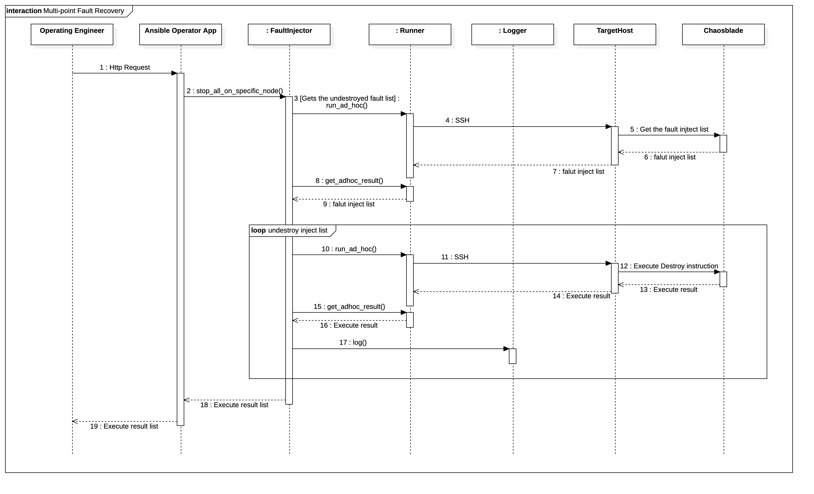

***

#### Use Case：Get Kubernetes Configuration Info

##### 1. Get Kubernetes Namespace Info

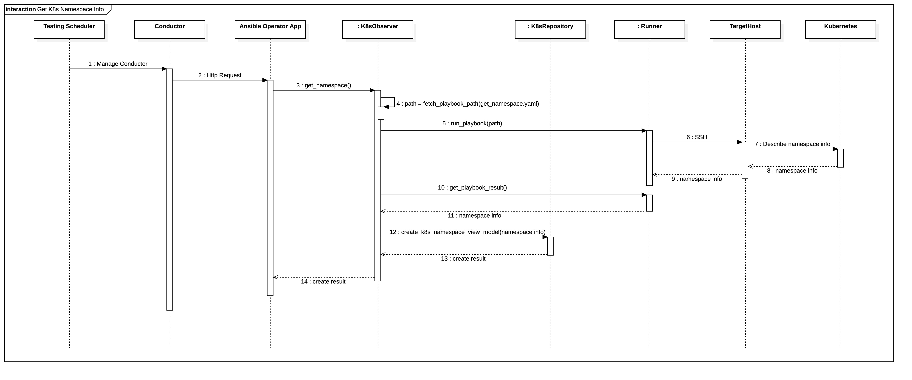

***

##### 2. GetKubernetes Service Info

***

##### 3. Get Kubernetes Deployment Info

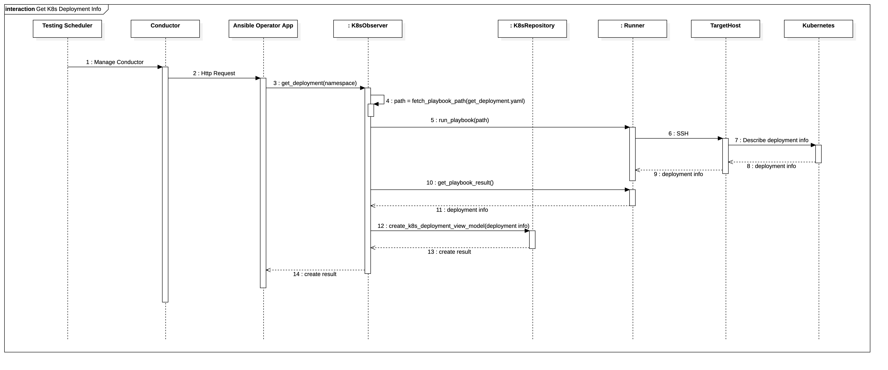

***

##### 4. Get Kubernetes Node Info

***

##### 5. Get Kubernetes Pods Info

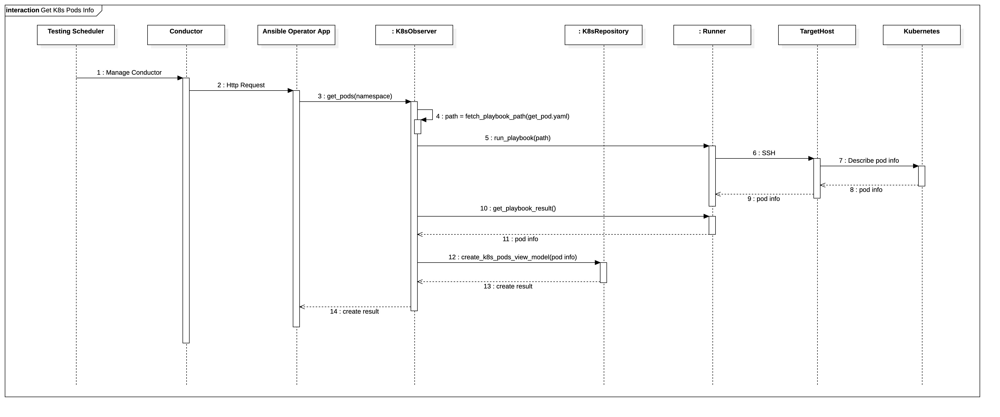

***

##### 6. Get Kubernetes Info From Topology

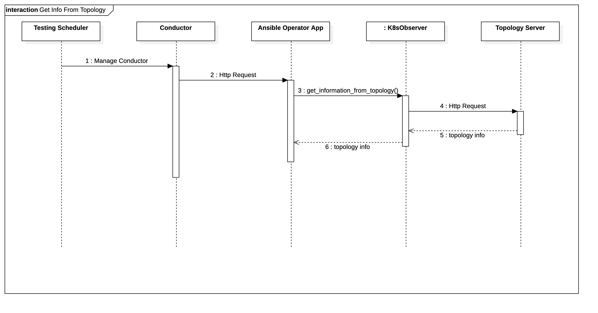

***

#### Use Case：Get Performance Data	

##### 1. Get Kubernetes Service Log

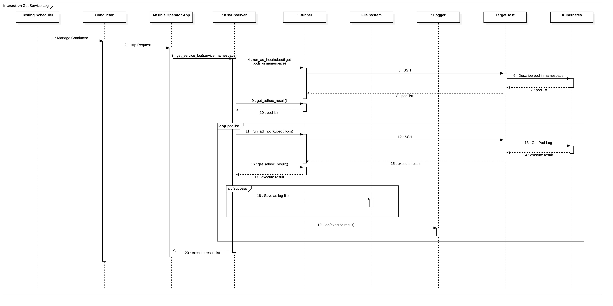

***

#####  2. Get Monitoring Data from Prometheus

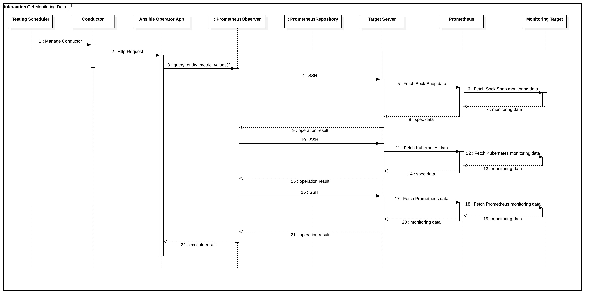

##### 3. Get Monitoring Data from Influxdb

***

## Class Design

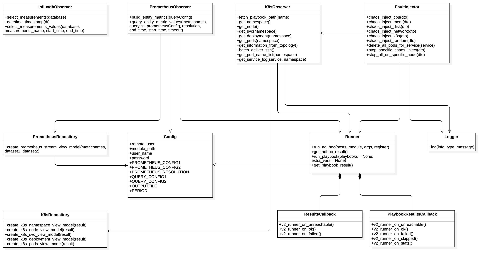

***

### K8sObserver

*service*

public class **K8sObserver**

Gets descriptive information about the kubernetes namespace, pod, deployment, and service.

#### Methods

> fetch_playbook_path

| fetch_playbook_path(name) |                            |
| ------------------------- | -------------------------- |
| **description**           | Get the playbook file path |
| **returns**               | Path of the playbook       |
| **parameters**            | String name                |

> get_namespace

| get_namespace() |                                     |
| --------------- | ----------------------------------- |
| **description** | Get the all namespace on kubernetes |
| **returns**     | All namespace on kubernetes         |
| **parameters**  | None                                |

> get_svc

| get_svc(namespace) |                                                            |
| ------------------ | ---------------------------------------------------------- |
| **description**    | Get the all services on kubernetes under certain namespace |
| **returns**        | All services on kubernetes under certain namespace         |
| **parameters**     | String namespace                                           |

> get_deployment

| get_deployment(namespace) |                                                              |
| ------------------------- | ------------------------------------------------------------ |
| **description**           | Get the all deployments on kubernetes under certain namespace |
| **returns**               | All deployments on kubernetes under certain namespace        |
| **parameters**            | String namespace                                             |

> get_pods

| get_pods(namespace) |                                                        |
| ------------------- | ------------------------------------------------------ |
| **description**     | Get the all pods on kubernetes under certain namespace |
| **returns**         | All pods on kubernetes under certain namespace         |
| **parameters**      | String namespace                                       |

> get_pod_name_list

| get_pod_name_list(namespace) |                                                              |
| ---------------------------- | ------------------------------------------------------------ |
| **description**              | Get the all pods' name on kubernetes under certain namespace |
| **returns**                  | List which contains all pods' name on kubernetes under certain namespace |
| **parameters**               | String namespace                                             |

> get_service_log

| get_service_log(service, namespace) |                                                              |
| ----------------------------------- | ------------------------------------------------------------ |
| **description**                     | Gets and save the full log of a service under certian namespace |
| **returns**                         | Json with log storage path                                   |
| **parameters**                      | String service String namespace                         |

***

### FaultInjector

*service*

public class **FaultInjector**

To execute specific fault injection on the target host machine. 

#### Methods

> chaos_inject_cpu

| chaos_inject_cpu(dto) |                                                              |
| --------------------- | ------------------------------------------------------------ |
| **description**       | Injects a CPU fault of a specified time bound on the target host |
| **returns**           | Json execution result                                        |
| **parameters**        | Dictionary dto                                               |

> chaos_inject_mem

| chaos_inject_mem(dto) |                                                              |
| --------------------- | ------------------------------------------------------------ |
| **description**       | Injects a Memory fault of a specified time bound and occupancy rate on the target host |
| **returns**           | Json execution result                                        |
| **parameters**        | Dictionary dto                                               |

> chaos_inject_disk

| chaos_inject_disk(dto) |                                                              |
| ---------------------- | ------------------------------------------------------------ |
| **description**        | Injects a Disk fault of a specified time bound and type(read/write) on the target host |
| **returns**            | Json execution result                                        |
| **parameters**         | Dictionary dto                                               |

> chaos_inject_network

| chaos_inject_network(dto) |                                                              |
| ------------------------- | ------------------------------------------------------------ |
| **description**           | Injects a Network fault of a specified time bound and delay on the target host |
| **returns**               | Json execution result                                        |
| **parameters**            | Dictionary dto                                               |

> chaos_inject_k8s

| chaos_inject_k8s(dto) |                                                              |
| --------------------- | ------------------------------------------------------------ |
| **description**       | Injects a k8s pod fault of a specified time bound on the target host |
| **returns**           | Json execution result                                        |
| **parameters**        | Dictionary dto                                               |

> chaos_inject_random

| chaos_inject_random(dto) |                        |
| ------------------------ | ---------------------- |
| **description**          | Random injection fault |
| **returns**              | Json execution result  |
| **parameters**           | Dictionary dto         |

> stop_specific_chaos_inject

| stop_specific_chaos_inject(dto) |                                                        |
| ------------------------------- | ------------------------------------------------------ |
| **description**                 | Stop specific fault inject based on the identification |
| **returns**                     | Json execution result                                  |
| **parameters**                  | Dictionary dto                                         |

> stop_all_on_specific_node

| stop_all_on_specific_node(dto) |                                             |
| ------------------------------ | ------------------------------------------- |
| **description**                | Stop all fault injection on the target host |
| **returns**                    | Json execution result                       |
| **parameters**                 | Dictionary dto                              |

> delete_all_pods_for_service

| delete_all_pods_for_service(dto) |                                                              |
| -------------------------------- | ------------------------------------------------------------ |
| **description**                  | Injects a k8s service fault of a specified time bound on the target host |
| **returns**                      | Json execution result                                        |
| **parameters**                   | String service                                               |

***

### PrometheusObserver

*service*

public class **PrometheusObserver**

To fetch and pack the prometheus monitoring data

#### Methods

> build_entity_metrics

| build_entity_metrics(queryConfig) |                                     |
| --------------------------------- | ----------------------------------- |
| **description**                   | Pack the prometheus monitoring data |
| **returns**                       | The packed data                     |
| **parameters**                    | Dictionary queryConfig              |

> query_entity_metric_values

| query_entity_metric_values (metricnames, querylist, prometheusConfig, resolution, end_time, start_time) |                                                              |
| ------------------------------------------------------------ | ------------------------------------------------------------ |
| **description**                                              | Grab raw monitoring data from promethues based on config     |
| **returns**                                                  | Packed csv format data                                       |
| **parameters**                                               | List metricnames List querylist List prometheusConfig List resolution String end_time String start_time |

> run

| run(dto)        |                                                        |
| --------------- | ------------------------------------------------------ |
| **description** | Run the collect data and pack data in the full process |
| **returns**     | The packed data                                        |
| **parameters**  | Dictionary dto                                         |

***

### InfluxdbObserver

*utils*

public class **InfluxdbObserver**

*write some description*

#### Methods

> select_measurements

| select_measurements(database) |                                                          |
| ----------------------------- | -------------------------------------------------------- |
| **description**               | Grab all measurements' names of the database user inputs |
| **return**                    | A list with all measurements' names                      |
| **parameters**                | String database                                          |

> datetime_timestamp()

| datetime_timestamp(dt) | |
| ---------------------- | ------ |
| **description**        | Change the time style from what user inputs to InfluxDB needs |
| **return**             | Time with property data type InfluxDB needs |
| **parameters**         | String dt |

> select_measurements_values()

| select_measurements_values (database, measurements_name, start_time, end_time) |                                                              |
| ------------------------------------------------------------ | ------------------------------------------------------------ |
| **description**                                              | Grab data with the period of the user inputs from the measurement of database |
| **return**                                                   | A list of data from InfluxDB                                 |
| **parameters**                                               | String database String measurements_name String start_time String end_time |

***

### Runner

*utils*

public class **Runner**

Call the local ansible APIs and execute ad-hoc and play-book based task

#### Methods

> run_ad_hoc

| run_ad_hoc (self, hosts=None,module=None,  args=None, register=None) |                                                              |
| ------------------------------------------------------------ | ------------------------------------------------------------ |
| **description**                                              | Exectue ad-hoc task                                          |
| **returns**                                                  | The execution data                                           |
| **parameters**                                               | String hosts String module List args String register |

> get_adhoc_result

| get_adhoc_result(self) |                                         |
| ---------------------- | --------------------------------------- |
| **description**        | Get and pack ad-hoc task execution data |
| **returns**            | Packed json format data                 |
| **parameters**         | None                                    |

> run_playbook

| run_playbook (self, playbooks, extra_vars) |                                       |
| ----------------------------------------------- | ------------------------------------- |
| **description**                                 | Exectue tasks based on play-book      |
| **returns**                                     | The execution data                    |
| **parameters**                                  | String playbooks List extra_vars |

> get_playbook_result

| get_playbook_result(self) |                                                  |
| ------------------------- | ------------------------------------------------ |
| **description**           | Get and pack play-book based task execution data |
| **returns**               | Packed json format data                          |
| **parameters**            | None                                             |

***

### Logger

*utils*

public class **Logger**

Normalized log output

#### Methods

> log

| log(info_type, message) |                                      |
| ----------------------- | ------------------------------------ |
| **description**         | Formatted output log                 |
| **returns**             | None                                 |
| **parameters**          | String info_type String message |

***

### Config

*utils*

public class **Config**

Ansible and prometheus configuration parameters

#### Fields

| Modifier and Type | Field                 | Description             |
| ----------------- | --------------------- | ----------------------- |
| public String     | remote_user           |                         |
| public String     | module_path           | Ansible path            |
| public String     | user_name             | username                |
| public String     | password              | password                |
| public Dictionary | PROMETHEUS_CONFIG1    | prometheus config       |
| public Dictionary | PROMETHEUS_CONFIG2    | prometheus config       |
| public Dictionary | PROMETHEUS_RESOLUTION | prometheus_resolution   |
| public Dictionary | QUERY_CONFIG1         | prometheus query config |
| public Dictionary | QUERY_CONFIG2         | prometheus query config |
| public String     | OUTPUTFILE            | output file name        |
| public Int        | PERIOD                |                         |

***

### K8sRepository

*view_model*

public class **k8sRepository**

Create k8s view model

#### Methods

> create_k8s_namespace_view_model

| create_k8s_namespace_view_model(result) |                                                           |
| --------------------------------------- | --------------------------------------------------------- |
| **description**                         | Create k8s namespace view model                           |
| **returns**                             | create result                                             |
| **parameters**                          | Json result which contains K8s namespace information |

> create_k8s_node_view_model

| create_k8s_node_view_model(result) |                                                      |
| ---------------------------------- | ---------------------------------------------------- |
| **description**                    | Create k8s node view model                           |
| **returns**                        | create result                                        |
| **parameters**                     | Json result which contains K8s node information |

> create_k8s_svc_view_model

| create_k8s_svc_view_model(result) |                                                         |
| --------------------------------- | ------------------------------------------------------- |
| **description**                   | Create k8s service view model                           |
| **returns**                       | create result                                           |
| **parameters**                    | Json result which contains K8s service information |

> create_k8s_deployment_view_model

| create_k8s_deployment_view_model(result) |                                                            |
| ---------------------------------------- | ---------------------------------------------------------- |
| **description**                          | Create k8s deployment view model                           |
| **returns**                              | create result                                              |
| **parameters**                           | Json result which contains K8s deployment information |

> create_k8s_pods_view_model

| create_k8s_deployment_view_model(result) |                                                      |
| ---------------------------------------- | ---------------------------------------------------- |
| **description**                          | Create k8s pods view model                           |
| **returns**                              | Create result                                        |
| **parameters**                           | Json result which contains K8s pods information |

***

### PrometheusRepository

*view_model*

public class **PrometheusRepository**

Create prometheus stream view model data 

#### Methods

> create_prometheus_stream_view_model

| create_prometheus_stream_view_model (metricnames, dataset1, dataset2) |                                                              |
| ------------------------------------------------------------ | ------------------------------------------------------------ |
| **description**                                              | Create prometheus stream view model data                     |
| **returns**                                                  | Create result                                                |
| **parameters**                                               | List metricnames Packed csv format dataset1 Packed csv format dataset2 |

