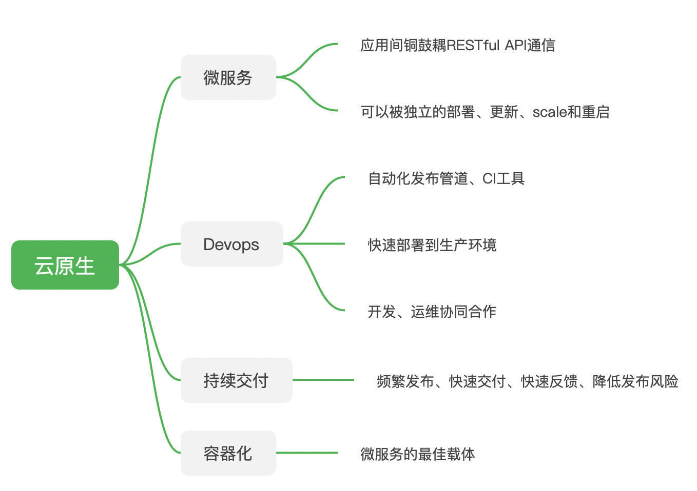
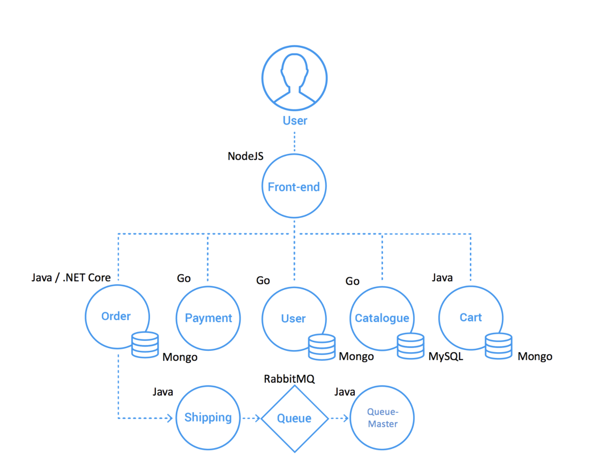
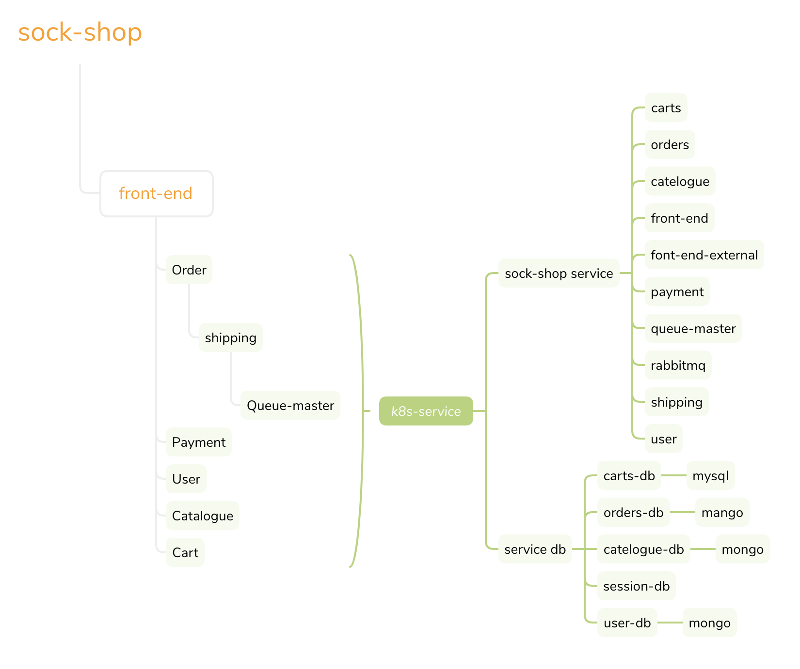
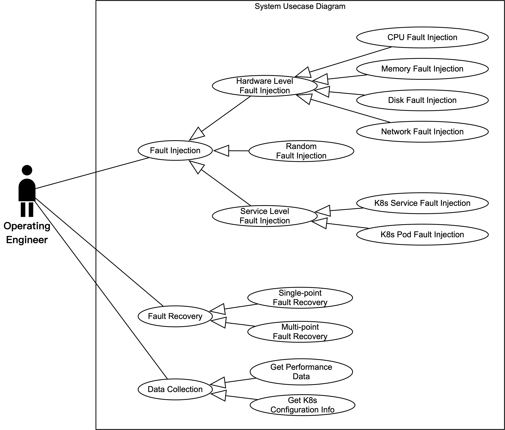

# 需求规约

## 项目介绍

#### 背景

##### 云原生概念的诞生

​		伴随着云计算的热潮，“云原生”的概念应运而生。云原生(Cloud Native)是一种利用云计算交付模型优势构建和运行应用程序的方法，有利于各组织在公有云、私有云和混合云等新型动态环境中，构建和运行可弹性扩展的应用。

​		云原生是“云”和“原生”的组合，它的具体应用如下图：



​		可以看到，作为诞生于云计算时代的新技术理念，云原生拥有传统IT无法比拟的优势，它很好地解释了云上运行的应用应该具备的特性——敏捷性、可扩展性和故障可恢复性。它帮助企业高效享受云的弹性和灵活性，从而实现平滑迁移、快速开发、稳定运维，大大降低技术成本。

​		Gartner报告指出，到2022年有75%的全球化企业将在生产中使用云原生的容器化应用。

##### Kubernetes

​		云计算催生了docker和微服务，后者又带领前者走向不断成熟，而Kubernetes则乘着docker和微服务的东风，快速蹿红。

​		Kubernetes是谷歌根据其内部使用的Borg改造成的通用容器编排调度器，它是一个开源的，用于管理云平台中多个主机上的容器化的应用，并且提供一个规范的，可以描述集群的架构，目的是让部署容器化应用简单并且高效。

​		Kubernetes是目前云原生架构的最佳选择，因此，Kubernetes的智能运维对整个云原生系统的运维有代表意义。

##### 智能运维

​		Kubernetes经过了几次版本迭代，已经展露锋芒，一系列基于Kubernetes的自动化工具也如雨后春笋般出现 。但Kubernetes目前也存在一些问题，其中较为突出的，就有部署与运维复杂和对上层应用的支持不够完善，需要编写配置大量的YAML文件等。

​		所以，针对云原生生态的应用前景，在2018年12月的KubeCon&CloudNativeCon Austin会议上，云原生生态圈的发展被确定有几大关键词：

- Service Mesh，在 Kubernetes 上践行微服务架构进行服务治理所必须的组件；
- Serverless，以 FaaS 为代表的无服务器架构将会流行开来；
- 加强数据服务承载能力，例如在 Kubernetes 上运行大数据应用；
- 简化应用部署与运维，包括云应用的监控与日志收集分析等。

##### 故障诊断与修复

​		故障诊断与修复是运维的重要组成部分。在智能运维的实验过程中需要不断模拟各种可能出现的故障，从而尽可能地模拟真实环境下系统出现异常的状况。因此，故障注入是整个智能运维实验过程中重要的组成部分。

​		通过故障注入，可以对系统的可靠性进行验证、作为运维检验的根据传递进知识图谱，以及生成智能运维中最为的关键数据来源：故障日志与故障下的性能数据。

​		在此背景下，本项目力求基于 Kubernetes，开发智能运维工具中的一个部分，即在硬件层面和软件服务层面进行故障注入，获取故障日志；同时访问时序数据库，获取故障性能数据，为智能运维提供关键的数据来源。

#### 项目目标

​		项目旨在为基于Kubernetes集群构建的微服务系统提供自动化的故障注入服务，通过故障注入结果（生成的日志与数据库性能数据），分析微服务系统的容错机制是否足够，服务编排是否合理，应急措施是否完善。有助于帮助系统开发者测试系统的性能，从而进行更好的优化。

#### 面向用户

本项目面向基于Kubernetes集群构建的微服务项目的开发与运维人员。

#### 项目边界

本项目提供的功能有：故障注入(CPU, 网络，内存，磁盘，Service，Pod)；故障恢复(单个故障，某节点所有故障，所有节点所有故障)；日志(攻击注入与故障恢复日志，集群Pod日志)；Kubernetes集群信息(Pods, Service, node, namespace)；数据信息(基由Prometheus从Kunernetes集群获得的监控数据，InfluxDB持久化信息)

本项目不提供日志自动分析服务，仅提供对于Sock-shop的分析文档。

---


#### 基本介绍

​		本项目为X-Lab实验室针对云平台微服务系统可靠性测试的故障注入项目。

​		项目使用Kubernetes、Docker构建微服务受测系统Sock-Shop；使用Conductor、Ansible、Chaosblade进行故障注入；使用Docker、Prometheus、Influxdb、Grafana对集群的性能进行监控；使用Ansible-Operator向实验室的其他项目组提供数据收集的接口。使用Jenkins将上述过程整合为自动化流程，最终达到测试云平台可靠性的目的。

---


#### 涉及工具

1. **Kubernetes**

      ​		Kubernetes是自动化容器操作的开源平台，这些操作包括部署，调度和节点集群间扩展。通过使用Kubernetes，可以做到以下几点：

      - 自动化容器的部署和复制
      - 随时扩展或收缩容器规模
      - 将容器组织成组，并且提供容器间的负载均衡 
      - 很容易地升级应用程序容器的新版本 
      - 提供容器弹性，如果容器失效就替换它，等等...

      ​		本项目是自动故障注入工具，项目的测试平台，是基于Kubernetes集群管理部署的Sock-shop微服务架构项目。该项目部署的主机管控5个物理机节点，作为管控节点存在。

      ​		Sock-shop内部使用docker容器拉起应用，多个或者一个容器在一个Pod中共享网络和文件系统，而Pod就是Kubernetes的基本资源调度单元。最终，Sock-shop提供的服务Service，则是pod的路由代理抽象，其用来处理pod之间的服务发现问题，即上下游pod之间的使用问题。Service保证pod动态变化对访问端透明，这意味着访问端只要知道Service的地址，而无需在意pod被重启或删除重建导致的动态改变。

      ​		**Sock-shop基本架构如下**：

      

      **其对应的Kubernetes资源服务情况如下**：

      

      

      ---

      

2. **Docker**

      ​		Docker是对Linux容器的一种封装，它可以提供一次性的环境、弹性的云服务或者组件微服务架构。

      ​		本项目基于使用的Sock-shop项目，是通过docker拉起的服务，如数据库服务myql或者tomcat。

      ---

      

3. **Ansible**

      ​		ansible是自动化运维工具，基于python开发，实现批量系统配置、批量程序部署、批量运行命令等功能，默认通过ssh协议管理机器。

      ​		项目使用kubeasz部署Kubernetes集群，开发时，通过ansible的ssh连接集群的所有节点。本项目有三个组:`Lab409-master`、`Lab409-hm`和`Lab409-vm`，分别代表跳板机，物理机与虚拟机，每个组下有各自的主机地址，配置方式如下：

      ```shell
      [Lab409-master]
      10.60.38.181:20022 ansible_user=root
      
      [Lab409-hm]
      192.168.199.31 ansible_user=root
      ......
      
      [Lab409-vm] 
      192.168.199.21 ansible_user=root
      ......
      ```
      
      ​		ansible有两种任务执行模式，分别是ad-hoc模式和playbook模式，前者使用单个模块，相当于在bash中执行shell语句，后者通过多个task集合完成一类功能，多个任务定义在一个文件里，相当于多个ad-hoc配置文件。
      
      ​		本项目分别采用ad-hoc模式对各个节点进故障注入，采用编写playbook方式获取整个集群的Pod、Service、Node和Deployment信息，充分考虑了ansible不同模式的使用特性。
      
      ---
      
      
      
4. **Chaosblade**

    ​		Chaosblade混沌工程，是建立在阿里巴巴多年故障测试和演练实践基础上的故障注入和恢复工具。它提供丰富故障场景实现，帮助提升分布式系统容错性和可恢复行。

    ​		目前，Chaosblade支持的演练场景有：硬件类的CPU、磁盘、内存、网络；Java应用类的Dubbo、MySQL、Servlet；自定义类方法延迟或抛出异常以及杀容器、Pod。本项目中，主要是用Chaosblade对Kubernetes集成管理的节点CPU、Men、Disk和Network以及Pod、Service进行模拟故障注入。

    ##### Chaosblade故障注入的作用

    ###### 衡量微服务的容错能力

    ​		通过模拟调用延迟、服务不可用、机器资源满载等，查看发生故障的节点或实例是否被自动隔离、下线，流量调度是否正确，预案是否有效，同时观察系统整体的 QPS 或 RT 是否受影响。在此基础上可以缓慢增加故障节点范围，验证上游服务限流降级、熔断等是否有效。最终故障节点增加到请求服务超时，估算系统容错红线，衡量系统容错能力。

    ###### 验证容器编排配置是否合理

    ​		通过模拟杀服务 Pod、杀节点、增大 Pod 资源负载，观察系统服务可用性，验证副本配置、资源限制配置以及 Pod 下部署的容器是否合理。

    ###### 测试 PaaS 层是否健壮

    ​		通过模拟上层资源负载，验证调度系统的有效性；模拟依赖的分布式存储不可用，验证系统的容错能力；模拟调度节点不可用，测试调度任务是否自动迁移到可用节点；模拟主备节点故障，测试主备切换是否正常。

    ###### 验证监控告警的时效性

    ​		通过对系统注入故障，验证监控指标是否准确，监控维度是否完善，告警阈值是否合理，告警是否快速，告警接收人是否正确，通知渠道是否可用等，提升监控告警的准确和时效性。

    ###### 定位与解决问题的应急能力

    ​		通过故障突袭，随机对系统注入故障，考察相关人员对问题的应急能力，以及问题上报、处理流程是否合理，达到以战养战，锻炼人定位与解决问题的能力。

    ##### 当前项目使用

    ​		基于Chaosblade提供的故障模拟方法，我们可以通过一句命令，模拟某个特定的故障状态。在本项目中，我们使用ansible对不同的物理机节点注入单个或者批量注入特定的Chaosblade命令：模拟物理机CPU满载，磁盘不足或者I/O高，内存不足和网络异常状况；或者模拟Kubernetes集群一个Pod被杀死，甚至一个Service停止的情况。最终获得物理机上的服务遭遇这些故障后产生的错误，综合分析该项目是否有较好的容错机制，是否具有合理的服务编排等。

    ---

    

5. **Jenkins**

    ​		Jenkins是一个开源的、提供友好操作界面的持续集成和持续交付工具，主要用于持续、自动的构架或测试软件项目，以及监控软件开放流程，快速问题定位及处理。

    ​		本项目提供自动故障注入服务，旨在为云平台模拟特殊的故障状况，从而帮助平台优化，增强平台的可靠性。因此，项目需要提供自动化的服务，需要明确每次构建的时间，故障类别等信息。

    ​		通过Jenkins对项目进行持续集成与交付，不但可以明确展示项目的迭代更新，而且可以跟踪到每次的构建情况，与本项目需求吻合。

    ---

    

6. **Prometheus**

    ​		基于对数据采集、分析和性能监控的需求，项目采用exporter+prometheus+grafana的Kubernetes监控方案。它的总体流程是：数据采集-->汇总-->处理-->存储-->展示。

    ​		Prometheus是一个开源的服务监控系统和时序数据库，它除了可以收集基本的资源指标（CPU、Network、Disk和Memory）外，也可以收集Kubernetes指标，容器指标，节点资源指标以及应用程序指标。

    ​		Prometheus分为server端和agent端，server端从被监控主机获取数据，agent端则部署node_exporter用于数据的采集。

    ​		Promotheus进行数据抓取，并通过grafana可视化工具实时展现，本项目对节点的攻击注入，就可以实时表现在可视化工具上，便于节点的状态监控和数据的分析。

    ---

    

7. **Influxdb**

    ​		项目使用Prometheus进行数据的采集、监控和可视化，然而，由于本项目Prometheus本身部署于Kubernetes，当Pod遭到意外删除等状况，之前获取的数据就会不复存在。

    ​		基于对数据的安全与持久性考虑，本项目使用InfluxDB时序数据库对Prometheus获取的监控数据进一步存取，实现数据的持久化。

    ---

    

8. **Conductor**

    ​		由于项目不断迭代，基于传统发布/订阅模式的点对点任务编排方法无法适应由于服务数量增长和流程复杂性提高带来的新需求，因此，本项目使用Conductor微服务编排框架，实现对基本和复杂业务流的创建、执行和管理等工作，并且通过Conductor自带的可视化工具增强流程可见性和可追溯性。	

***


## 项目需求分析


***


## 用例分析



***

| Use Case | CPU Fault Injection                                          |
| -------- | ------------------------------------------------------------ |
| 用例描述 | 该用例允许用户针对k8s集群内指定的一台主机(物理机/虚拟机)<br />进行指定时长的CPU故障的注入； |
| 参与者   | Operating Engineer                                           |
| 前置条件 | 1. ansible成功与目标主机建立ssh密钥信任；<br />2. chaosblade成功配置在目标主机内； |
| 基本流程 | 1. 用户将目标主机的IP地址及故障注入时长传入给定的CPU故障注入的API接口；<br />2. 系统根据传入的参数生成相应的CPU故障注入命令；<br />3. 系统在目标远程主机上执行CPU故障注入命令；<br />4. 系统返回命令的执行结果； |
| 异常     | 1.1 目标主机IP地址不在k8s集群中，系统将返回主机不存在的提示信息；<br />1.2 目标主机已进行过CPU故障注入，且此故障注入未被恢复<br />       系统将返回主机已被注入CPU故障的提示信息; |
| 后置条件 | 系统记录故障注入的执行情况及结果并输出到日志中；             |

***

| Use Case | Memory Fault Injection                                       |
| -------- | ------------------------------------------------------------ |
| 用例描述 | 该用例允许用户针对k8s集群内指定的一台主机(物理机/虚拟机)<br />进行指定内存占用程度及时长的Memory故障的注入； |
| 参与者   | Operating Engineer                                           |
| 前置条件 | 1. ansible成功与目标主机建立ssh密钥信任；<br />2. chaosblade成功配置在目标主机内； |
| 基本流程 | 1. 用户将目标主机的IP地址，内存占用率及故障注入时长<br />    传入给定的Memory故障注入的API接口；<br />2. 系统根据传入的参数生成相应的Memory故障注入命令；<br />3. 系统在目标远程主机上执行Memory故障注入命令；<br />4. 系统返回命令的执行结果； |
| 异常     | 1.1 目标主机IP地址不在k8s集群中，系统将返回主机不存在的提示信息；<br />1.2 目标主机已进行过Memeory故障注入，且此故障注入未被恢复<br />       系统将返回主机已被注入Memeory故障的提示信息； |
| 后置条件 | 系统记录故障注入的执行情况及结果并输出到日志中；             |

***

| Use Case | Disk Fault Injection                                         |
| -------- | ------------------------------------------------------------ |
| 用例描述 | 该用例允许用户针对k8s集群内指定的一台主机(物理机/虚拟机)<br />进行指定类型(读/写)及时长的Disk故障的注入； |
| 参与者   | Operating Engineer                                           |
| 前置条件 | 1. ansible成功与目标主机建立ssh密钥信任；<br />2. chaosblade成功配置在目标主机内； |
| 基本流程 | 1. 用户将目标主机的IP地址，故障注入类型及故障注入时长<br />    传入给定的Disk故障注入的API接口；<br />2. 系统根据传入的参数生成相应的Disk故障注入命令；<br />3. 系统在目标远程主机上执行Disk故障注入命令；<br />4. 系统返回命令的执行结果； |
| 异常     | 1.1 目标主机IP地址不在k8s集群中，系统将返回主机不存在的提示信息；<br />1.2 目标主机已进行过Disk故障注入，且此故障注入未被恢复<br />       系统将返回主机已被注入Disk故障的提示信息； |
| 后置条件 | 系统记录故障注入的执行情况及结果并输出到日志中；             |

***

| Use Case | Network Fault Injection                                      |
| -------- | ------------------------------------------------------------ |
| 用例描述 | 该用例允许用户针对k8s集群内指定的一台主机(物理机/虚拟机)<br />进行指定延时时间及注入时长的Network故障的注入； |
| 参与者   | Operating Engineer                                           |
| 前置条件 | 1. ansible成功与目标主机建立ssh密钥信任；<br />2. chaosblade成功配置在目标主机内； |
| 基本流程 | 1. 用户将目标主机的IP地址，延时时间及故障注入时长<br />    传入给定的Network故障注入的API接口；<br />2. 系统根据传入的参数生成相应的Network故障注入命令；<br />3. 系统在目标远程主机上执行Network故障注入命令；<br />4. 系统返回命令的执行结果； |
| 异常     | 1.1 目标主机IP地址不在k8s集群中，系统将返回主机不存在的提示信息；<br />1.2 目标主机已进行过Network故障注入，且此故障注入未被恢复<br />       系统返回主机已被注入Network故障的提示信息； |
| 后置条件 | 系统记录故障注入的执行情况及结果并输出到日志中；             |

***

| Use Case | K8s Service Fault Injection                                  |
| -------- | ------------------------------------------------------------ |
| 用例描述 | 该用例允许用户针对k8s集群内特定的服务(Service)进行故障的注入； |
| 参与者   | Operating Engineer                                           |
| 前置条件 | 1. ansible成功建立ssh密钥信任；<br />2. chaosblade成功配置在目标主机内； |
| 基本流程 | 1. 用户将服务名称传入给定的k8s服务故障注入的API接口；<br />2. 系统获取运行该服务的pod列表；<br />3. 系统针对每个pod生成相应的k8s故障注入命令；<br />4. 系统在远程主机上执行故障注入命令；<br />5. 系统返回命令的执行结果； |
| 异常     |                                                              |
| 后置条件 | 系统记录故障注入的执行情况及结果并输出到日志中；             |

***

| Use Case | K8s Pod Fault Injection                                      |
| -------- | ------------------------------------------------------------ |
| 用例描述 | 该用例允许用户针对k8s集群内特定的pod进行故障的注入；         |
| 参与者   | Operating Engineer                                           |
| 前置条件 | 1. ansible成功建立ssh密钥信任；<br />2. chaosblade成功配置在目标主机内； |
| 基本流程 | 1. 用户将pod名称传入给定的k8s pod故障注入的API接口；<br />2. 系统根据传入的参数生成相应的k8s pod故障注入命令；<br />3. 系统在目标远程主机上执行故障注入命令；<br >4. 系统返回命令的执行结果； |
| 异常     |                                                              |
| 后置条件 | 系统记录故障注入的执行情况及结果并输出到日志中；             |

***

| Use Case | Random Fault Injection                                       |
| -------- | ------------------------------------------------------------ |
| 用例描述 | 该用例允许用户针对k8s集群内的主机进行随机故障注入；          |
| 参与者   | Operating Engineer                                           |
| 前置条件 | 1. ansible成功与目标主机建立ssh密钥信任；<br />2. chaosblade成功配置在目标主机内； |
| 基本流程 | 1. 系统随机选取一种故障注入的类别；<br />2. 系统随机选择一个目标主机；<br />3. 系统生成相应的故障注入命令；<br />4. 系统在目标远程主机上执行故障注入命令；<br />5. 系统返回命令的执行结果； |
| 异常     |                                                              |
| 后置条件 | 系统记录故障注入的执行情况及结果并输出到日志中；             |

***

| Use Case | Single-point Fault Recovery                                  |
| -------- | ------------------------------------------------------------ |
| 用例描述 | 该用例允许用户恢复某一特定的故障注入；                       |
| 参与者   | Operating Engineer                                           |
| 前置条件 | 1. ansible成功与目标主机建立ssh密钥信任；<br />2. chaosblade成功配置在目标主机内； |
| 基本流程 | 1. 用户将用于标识一个特定的故障注入的tag传入单点故障恢复API接口；<br />2. 系统获取此故障注入所在的目标主机的IP；<br />3. 系统生成相应的故障恢复命令；<br />4. 系统在目标远程主机上执行故障恢复命令；<br />5. 系统返回命令的执行结果； |
| 异常     | 2. 系统未查找到此故障注入的信息，系统返回未找到故障注入提示信息； |
| 后置条件 | 系统记录故障恢复命令的执行情况及结果并输出到日志中；         |

***

| Use Case | Multi-point Fault Recovery                                   |
| -------- | ------------------------------------------------------------ |
| 用例描述 | 该用例允许用户恢复某一特定主机上的所有故障注入；             |
| 参与者   | Operating Engineer                                           |
| 前置条件 | 1. ansible成功与目标主机建立ssh密钥信任；<br />2. chaosblade成功配置在目标主机内； |
| 基本流程 | 1. 用户将目标主机IP传入多点故障恢复API接口；<br />2. 系统获取此IP下全部的未被恢复故障注入的标识；<br />3. 系统生成相应的故障恢复命令；<br />4. 系统在目标远程主机上执行故障恢复命令；<br />5. 系统返回命令的执行结果； |
| 异常     | 1. 目标主机IP地址不在k8s集群中，系统将返回主机不存在的提示信息； |
| 后置条件 | 系统记录故障恢复命令的执行情况及结果并输出到日志中；         |

***

| Use Case | Get Performance Data                                         |
| -------- | ------------------------------------------------------------ |
| 用例描述 | 该用例允许用户获取k8s集群，Promethues，Sock-shop的性能数据   |
| 参与者   | Operating Engineer                                           |
| 前置条件 | ansible成功建立ssh密钥信任；                                 |
| 基本流程 | 1. 用户将开始时间、结束时间传入系统提供的API接口；<br />2. 系统获取该时间段下Prometheus获取的所有Sock-shop性能数据；<br />3. 系统将获取的数据输出到文件中；<br /> |
| 异常     | 1. 1 输入的时间段错误，系统返回结束值小于开始值问题；<br />1.2 Prometheus数据库中没有用户输入的时间段的数据，系统返回不存在数据； |
| 后置条件 |                                                              |

***

| Use Case | Get K8s Configuration Info                                   |
| -------- | ------------------------------------------------------------ |
| 用例描述 | 该用例允许用户获得k8s集群上的有关于<br />Namespace，Service，Pod，Deployment，Node的配置信息； |
| 参与者   | Operating Engineer                                           |
| 前置条件 | ansible成功建立ssh密钥信任；                                 |
| 基本流程 | 1. 用户调用系统提供的API接口；<br />2. 系统执行与接口对应的yaml文件；<br />3. 系统返回执行结果； |
| 异常     |                                                              |
| 后置条件 |                                                              |