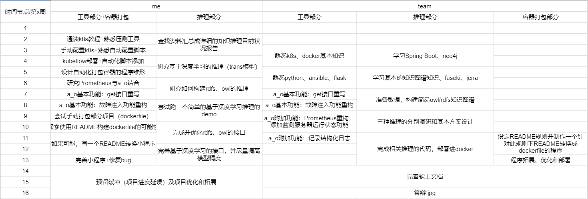
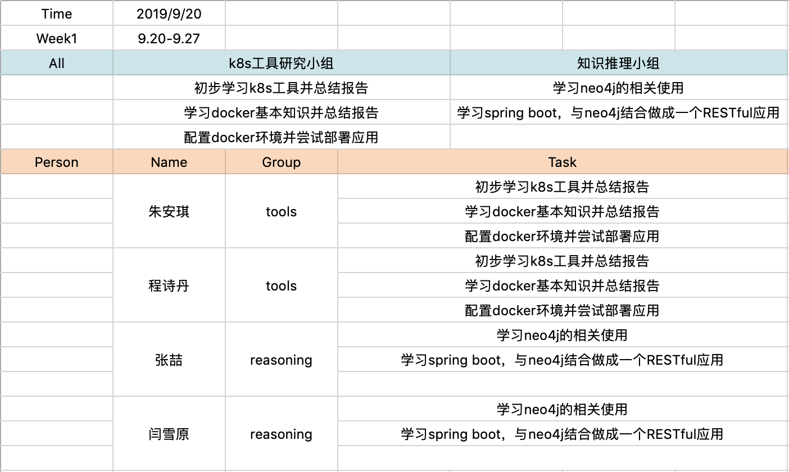
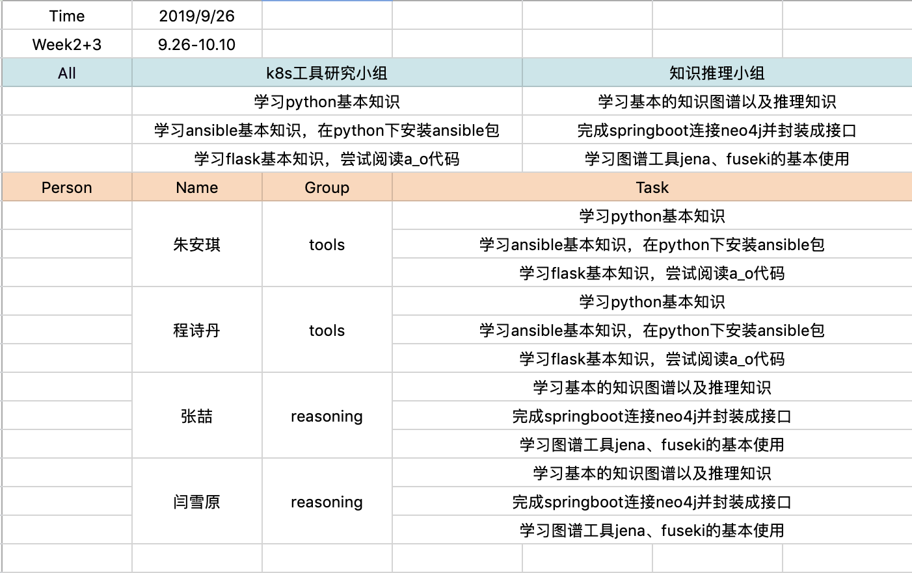
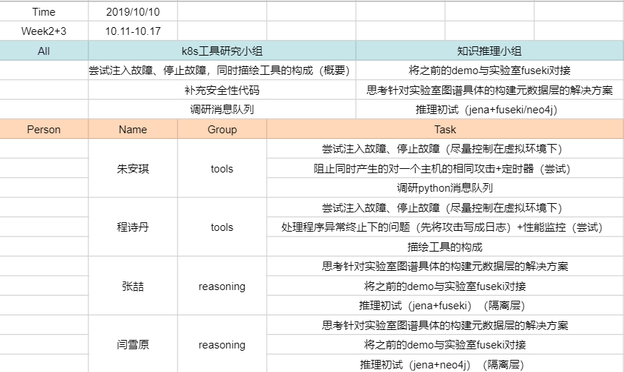

# 知识推理

[TOC]

------

## 总计划表

------

## 项目仓库

[2019-XLab-KnowledgeReasoning](https://github.com/baiyanquan/2019-XLab-KnowledgeReasoning)

------

## 参考资料

- [SpringBoot学习教程](https://blog.csdn.net/forezp/article/details/70341818)
- 知识图谱入门教程：小象学院-王昊奋知识图谱教程（着重看第一章和知识推理章节）

------

## 第一周任务

- [x] 学习neo4j的相关使用
- [x] 学习spring boot
- [ ] 与neo4j结合做成一个RESTful应用
- [ ] 尝试服务器/neo4j部署

------

## 第二周任务

-----

## 第三周任务

