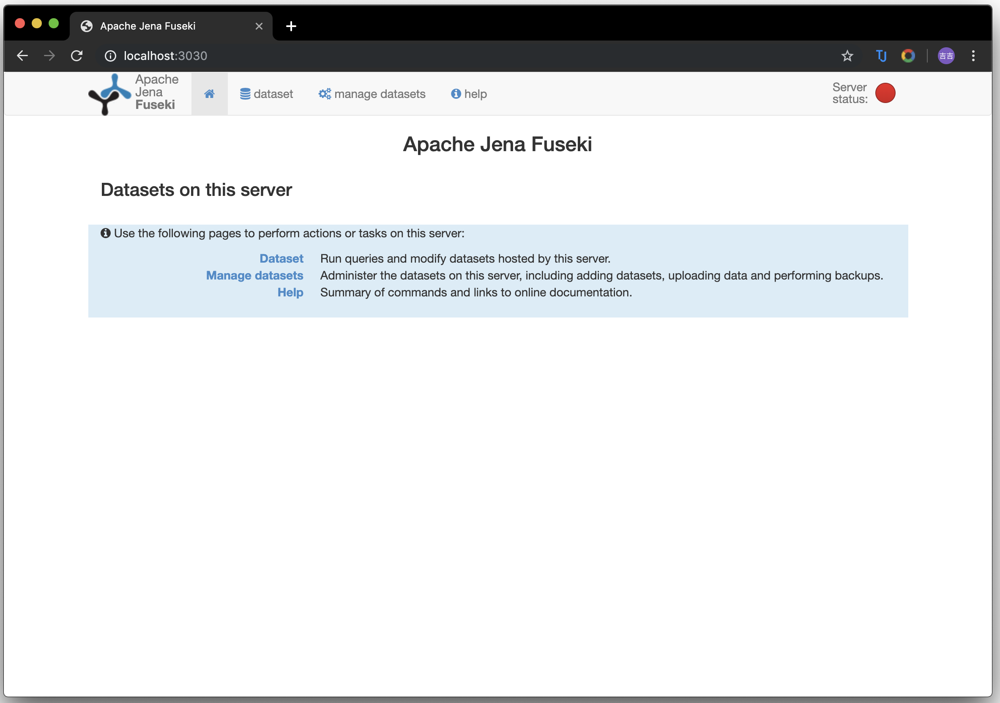

# Fuseki学习

Table of Contents
=================

   * [Fuseki学习](#fuseki学习)
      * [安装](#安装)

------

## 安装

- 下载[apache-jena-fuseki-3.13.0.zip](http://mirrors.tuna.tsinghua.edu.cn/apache/jena/binaries/apache-jena-fuseki-3.13.0.zip)

- `cd apache-jena-fuseki-3.13.0`

- `fuseki-server`

- 在浏览器中打开`localhost:3030/`

  