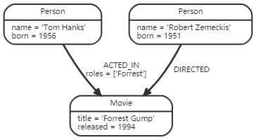
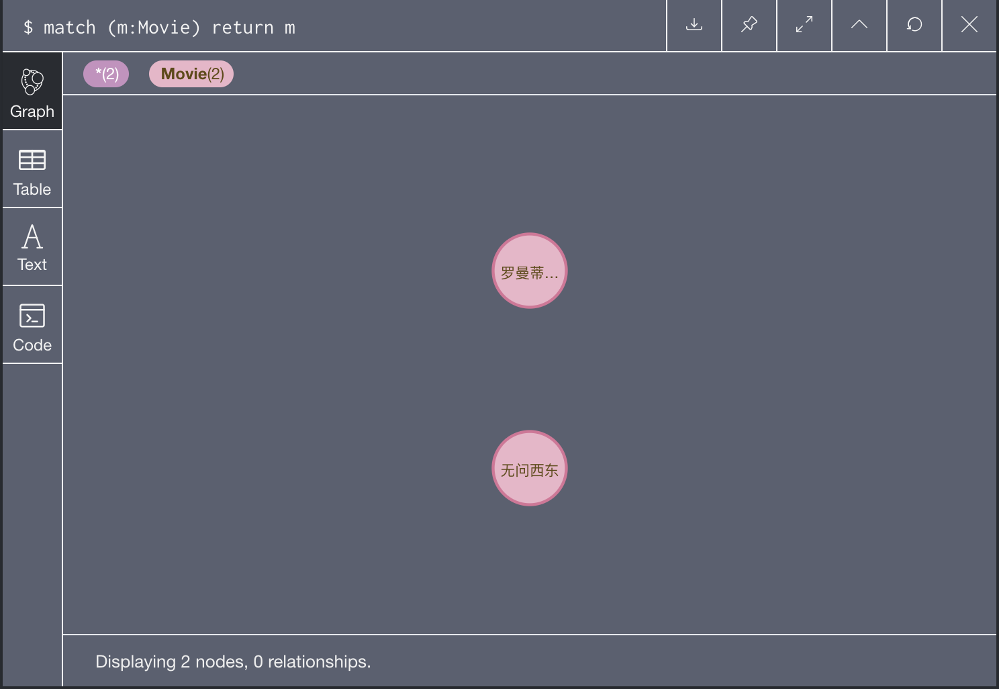
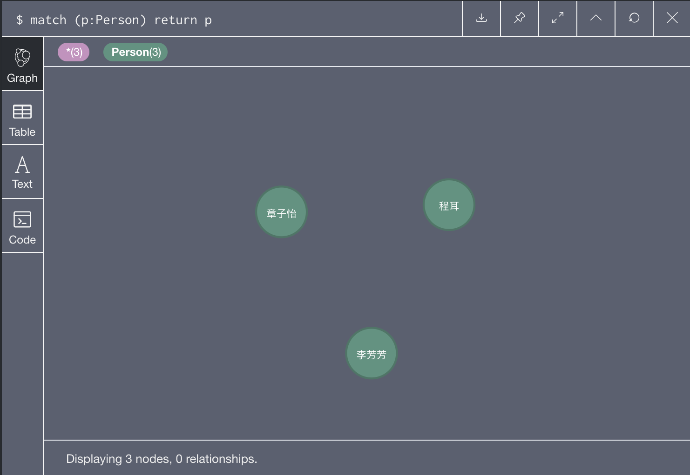
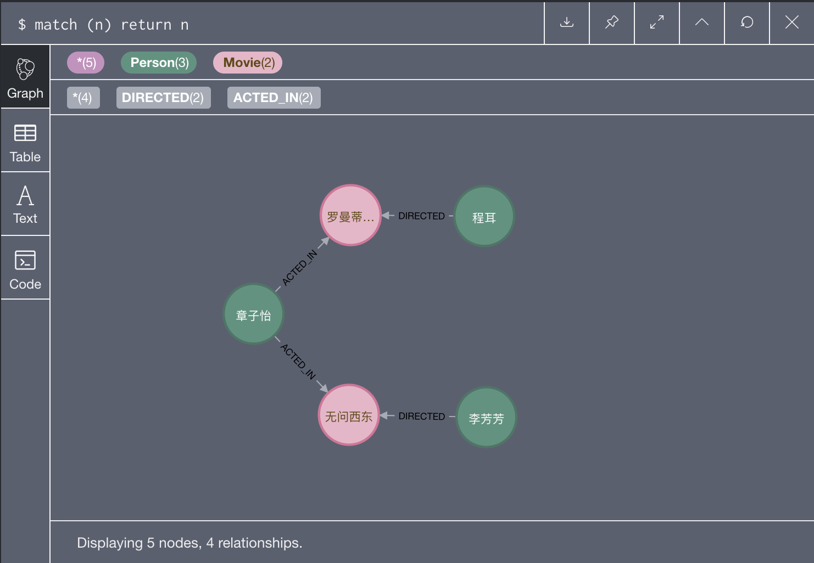
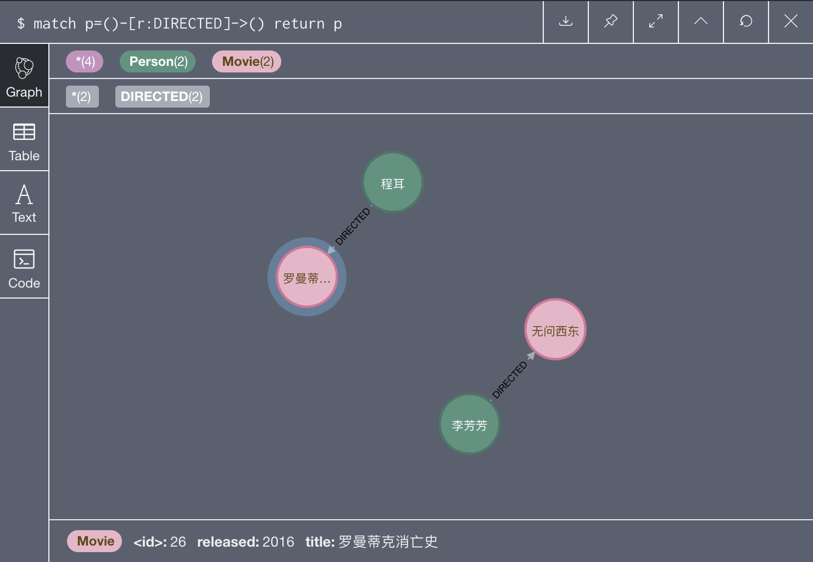
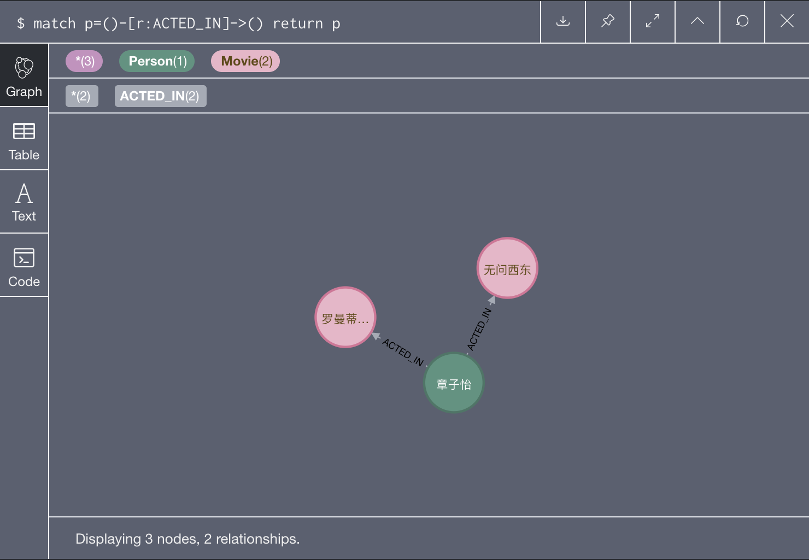
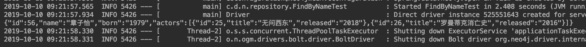
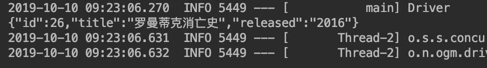
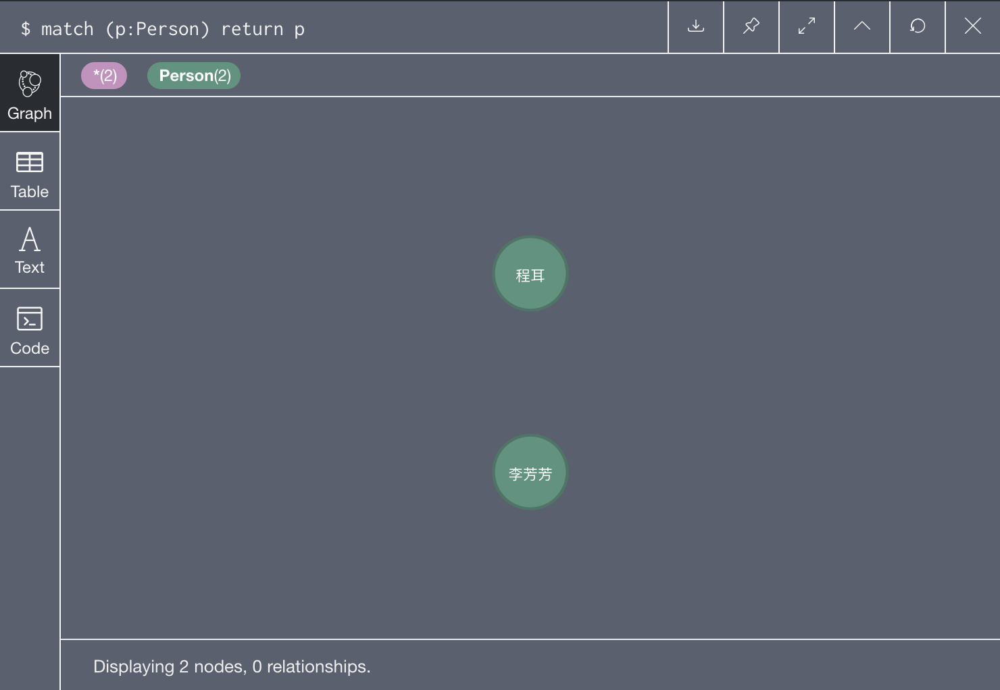
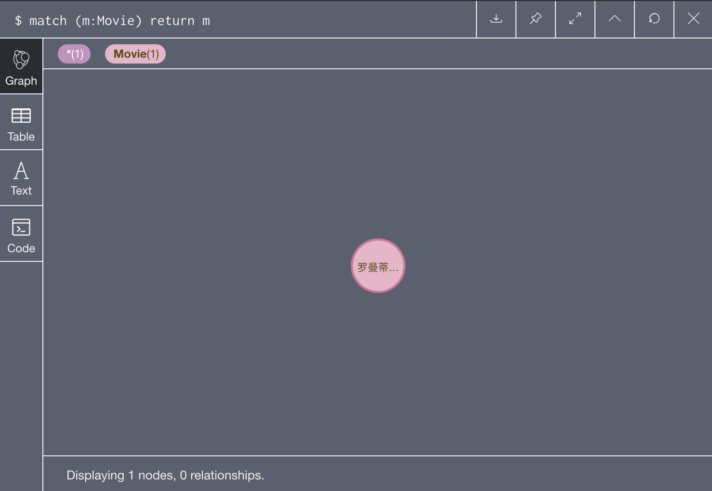

# SpringBoot连接Neo4j

Table of Contents
=================

   * [SpringBoot连接Neo4j](#springboot连接neo4j)
      * [项目实例需求](#项目实例需求)
      * [创建SpringBoot连接Neo4j项目](#创建springboot连接neo4j项目)
         * [自动引入neo4j的pom](#自动引入neo4j的pom)
      * [创建实体类](#创建实体类)
         * [Person类](#person类)
         * [Movie类](#movie类)
      * [建立Repository](#建立repository)
         * [PersonRepository](#personrepository)
         * [MovieRepository](#movierepository)
      * [建立关系](#建立关系)
         * [在Person中建立与Movie的演员、导演关系](#在person中建立与movie的演员导演关系)
      * [建立数据库连接](#建立数据库连接)
      * [单元测试](#单元测试)
         * [创建](#创建)
            * [Movie](#movie)
            * [Person](#person)
            * [Person与Movie的关系](#person与movie的关系)
         * [查找](#查找)
         * [删除](#删除)
            * [Person](#person-1)
            * [Movie](#movie-1)

------

## 项目实例需求



- Person类
  - name属性
  - born属性
- Movie类
  - title属性
  - released属性
- 联系
  - ACTED_IN
  - DIRECTED

------

## 创建SpringBoot连接Neo4j项目

- 勾选NoSQL-Spring DataNeo4j

  

### 自动引入neo4j的pom

```xml
<dependency>
  <groupId>org.springframework.boot</groupId>
  <artifactId>spring-boot-starter-data-neo4j</artifactId>
</dependency>
```

------

## 创建实体类

- @NodeEntity：节点

### Person类

```java
@NodeEntity		//标识节点
public class Person {
  @Id
  @GeneratedValue
  private Long id;
  private String name;
  private String born;

  // 从 Neo4j API 2.0.5开始需要无参构造函数
  /* 无参构造函数 */

  /* 构造函数 */

  /* getter */

  /* setter */
  
}
```

### Movie类

```java
@NodeEntity
public class Movie {
  @Id
  @GeneratedValue
  private Long id;
  private String title;
  private String released;

  /* 无参构造函数 */
  
  /* 构造函数 */

  /* getter */

  /* setter */
  
}
```

## 建立Repository

- 继承自CrudRepository

### PersonRepository

```java
public interface PersonRepository extends CrudRepository<Person, Long> {
    Person findByName(String name);
}
```

### MovieRepository

```java
public interface MovieRepository extends CrudRepository<Movie, Long> {
    Movie findByTitle(String title);
}
```

## 建立关系

### 在Person中建立与Movie的演员、导演关系

- @Relationship：关系
  - type：关系名称
  - direction：方向
    - 这里的OUTGOING表示 Person --> Movie

```java
@Relationship(type = "ACTED_IN", direction = Relationship.OUTGOING)
public Set<Movie> actors;

public void addActor(Movie movie) {
  if (actors == null) {
    actors = new HashSet<>();
  }
  actors.add(movie);
}

@Relationship(type = "DIRECTED", direction = Relationship.OUTGOING)
public Set<Movie> directors;

public void addDirector(Movie movie) {
  if (directors == null) {
    directors = new HashSet<>();
  }
  directors.add(movie);
}
```

## 建立数据库连接

可以使用.properties也可以使用.yml

- application.properties

  ```properties
  spring.data.neo4j.uri=bolt://localhost:7687
  spring.data.neo4j.username=neo4j
  spring.data.neo4j.password=neo4j
  ```

- application.yml

  ```yml
  spring:
      data:
          neo4j:
              uri: bolt://localhost:7687
              username: neo4j
              password: neo4j
  ```

## 单元测试

### 创建

#### Movie

```java
@Test
public void testSaveMovie() {

  movieRepo.deleteAll();
  personRepo.deleteAll();
  Movie m1 = new Movie("无问西东", "2018");
  Movie m2 = new Movie("罗曼蒂克消亡史", "2016");
  movieRepo.save(m1);
  movieRepo.save(m2);

}
```



#### Person

```java
@Test
public void testSavePerson() {
  Person p1 = new Person("章子怡", "1979");
  Person p2 = new Person("李芳芳", "1976");
  Person p3 = new Person("程耳", "1970");

  personRepo.save(p1);
  personRepo.save(p2);
  personRepo.save(p3);
}
```



#### Person与Movie的关系

```java
@Test
public void testCreateRelationship(){
  Person p1 = personRepo.findByName("章子怡");
  Person p2 = personRepo.findByName("李芳芳");
  Person p3 = personRepo.findByName("程耳");

  Movie m1 = movieRepo.findByTitle("罗曼蒂克消亡史");
  Movie m2 = movieRepo.findByTitle("无问西东");

  if (m1!=null) {
    if(p1!=null){
      p1.addActor(m1);
    }
    if(p3!=null){
      p3.addDirector(m1);
    }
  }
  if (m2!=null) {
    if(p1!=null){
      p1.addActor(m2);
    }
    if(p2!=null){
      p2.addDirector(m2);
    }
  }

  personRepo.save(p1);
  personRepo.save(p2);
  personRepo.save(p3);
}
```







### 查找

```java
@Test
public void testfindByTitle() {
  Movie movie = movieRepo.findByTitle("罗曼蒂克消亡史");
  System.out.println(JsonSimple.toJson(movie));
}

@Test
public void testfindByName() {
  Person person = personRepo.findByName("章子怡");
  System.out.println(JsonSimple.toJson(person));
}
```





### 删除

#### Person

```java
@Test
public void testRemovePerson(){
  Person p = personRepo.findByName("章子怡");
  personRepo.delete(p);
}
```



#### Movie

```java
@Test
public void testRemoveMovie(){
  Movie m = movieRepo.findByTitle("无问西东");
  movieRepo.delete(m);
}
```



