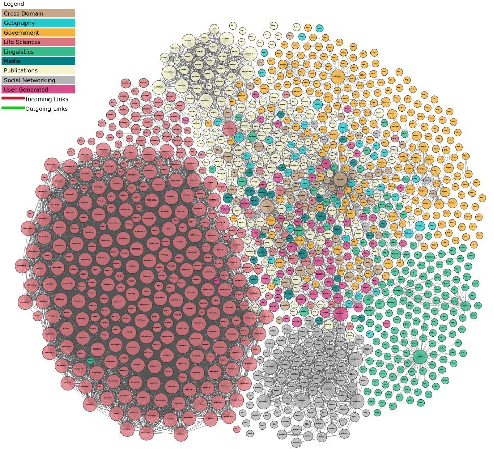
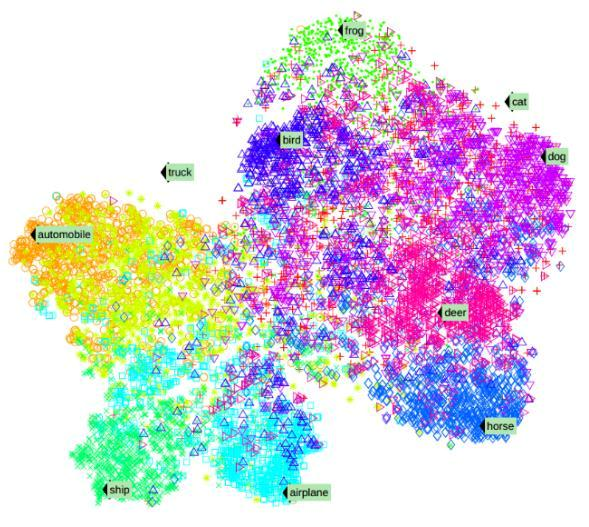
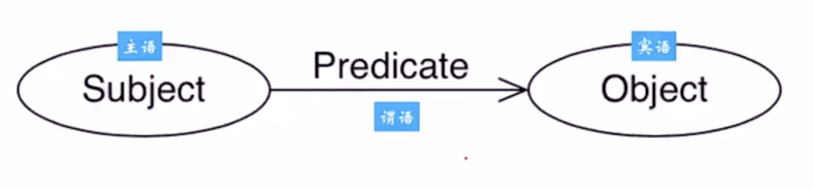
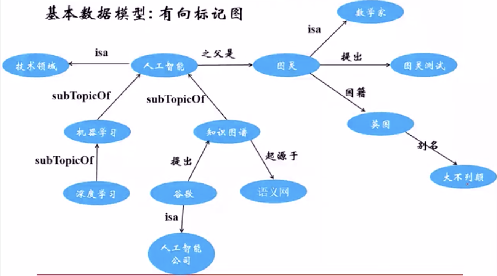
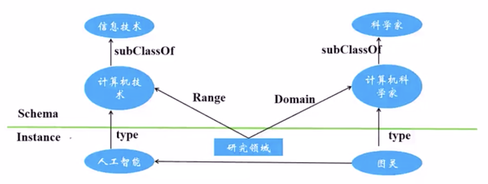
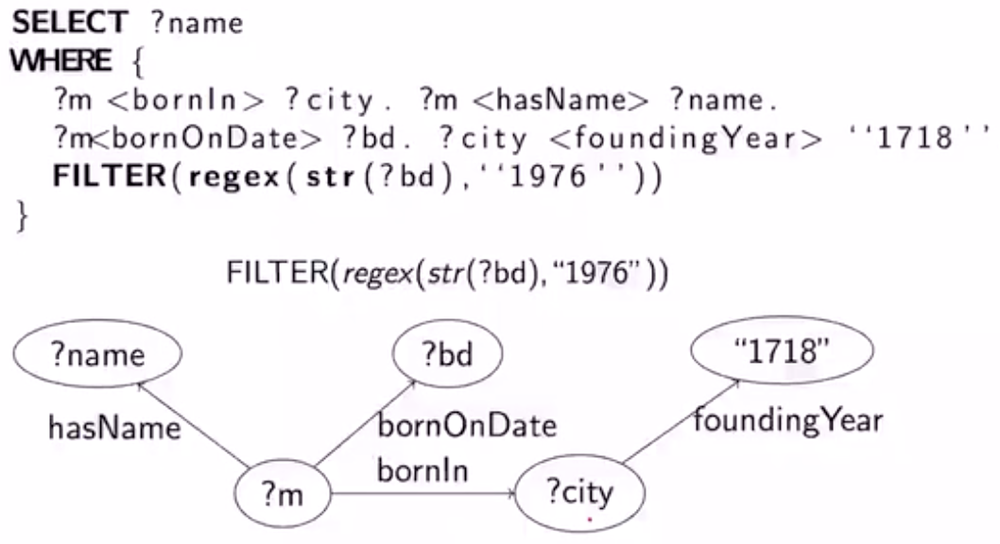
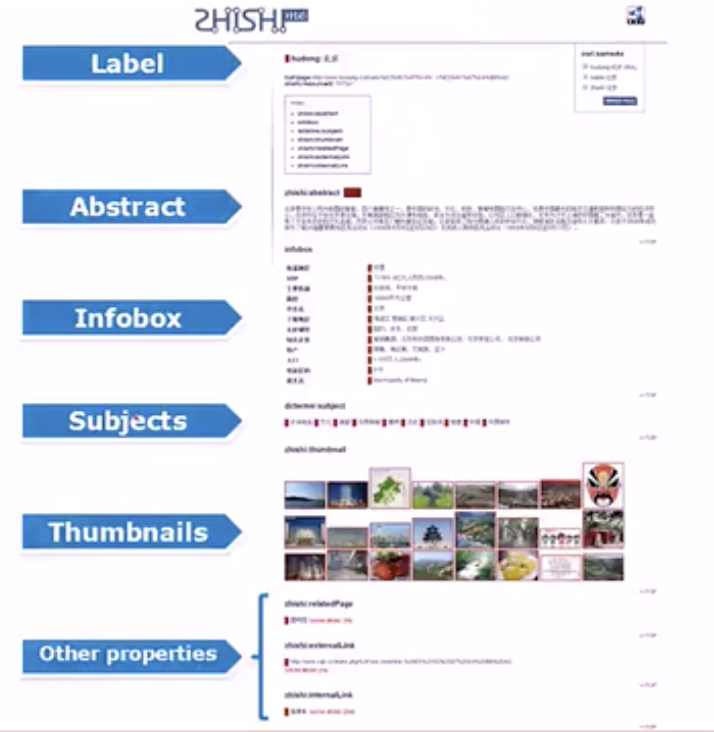

# 知识图谱

Table of Contents
=================

   * [知识图谱](#知识图谱)
      * [历史](#历史)
      * [本质](#本质)
      * [KG的分布式表示](#kg的分布式表示)
         * [基于离散符号的知识表示](#基于离散符号的知识表示)
         * [基于连续向量的知识表示](#基于连续向量的知识表示)
      * [应用](#应用)
         * [KG辅助搜索 ｜ KG4SEO](#kg辅助搜索--kg4seo)
         * [KG辅助问答 ｜ KG4BOTS](#kg辅助问答--kg4bots)
         * [KG辅助决策](#kg辅助决策)
         * [KG辅助AI](#kg辅助ai)
      * [技术体系](#技术体系)
         * [数据来源](#数据来源)
         * [RDF](#rdf)
         * [RDF Graph](#rdf-graph)
         * [RDFS](#rdfs)
         * [OWL](#owl)
         * [SPARQL](#sparql)
         * [JSON-LD](#json-ld)
      * [典型知识图谱项目](#典型知识图谱项目)
         * [CYC](#cyc)
         * [Wordnet](#wordnet)
         * [ConceptNet](#conceptnet)
         * [Freebase](#freebase)
         * [Wikidata](#wikidata)
         * [DBPedia](#dbpedia)
         * [YAGO](#yago)
         * [Babelnet](#babelnet)
         * [NELL](#nell)
         * [微软Concept Graph](#微软concept-graph)
         * [OpenKG ｜ 中国知识图谱资源数据库](#openkg--中国知识图谱资源数据库)
         * [Zhishi.me](#zhishime)
         * [cnSchema | 开放的中文知识图谱Schema](#cnschema--开放的中文知识图谱schema)

------

## 历史

- 1960: 语义网络
- 1980: 本体论
- 1989: Web
- 1998: The Semantic Web
- 2006: 开放数据的链接
- 2012: 谷歌发布知识图谱

------

## 本质

- **Web视角：**建立数据之间/实体之间的语义链接，并支持语义搜索
- **NLP视角：**从文本中提取语义和结构化数据 -> 形成知识
- **KR视角：**用计算机符号表示和处理知识
- **AI视角：**利用知识库辅助理解人的语言
- **DB视角：**用图的方式存储知识

## KG的分布式表示

在保留语义的同时，将知识图谱中的实体和关系映射到连续的稠密的低维向量空间

### 基于离散符号的知识表示

- RDF、OWL

- 显示知识：强逻辑约束，易于解释，推理不易扩展

   

### 基于连续向量的知识表示

- Tensor：神经网络的表示

- 隐式知识：弱逻辑约束，不宜解释，对接神经网络

   

------

## 应用

### KG辅助搜索 ｜ KG4SEO

SEO搜索引擎优化

- 网页搜索 -> 语义搜索
- 手工众包、格式转化、元组抽取、实体融合、链接预测、推理不全、语义嵌入

### KG辅助问答 ｜ KG4BOTS

- 给机器人及loT都挂接背景数据库
- 综合使用<u>文本 + KB + 深度神经网络</u>实现问答

### KG辅助决策

- 数据处理：
  - 文本 -> 预先抽取语义做数据链接
  - 多媒体 -> 更加规范的数据表示
  - 传感器的粗糙数据 -> 可计算的数据
- 机器可计算 --加入知识--> 机器可理解
- 把符号推理与统计学习结合起来，让碎片化知识图谱的知识推理和深度学习的决策模型结合起来

### KG辅助AI

- 常识推理
- 在信息理解上逐渐达到人的高度
- 但是计算速度上超过人类

------

## 技术体系

### 数据来源

- 文本数据 -> KBP
- 结构化数据库数据 -> D2R
- 多媒体数据 -> Linked Media
- 传感器数据 -> OneM2M
- 众包数据 -> WikiData

### RDF

Triple-based Assertion model



### RDF Graph

有向标记图



### RDFS

RDF Schema：为RDF定义词汇表   *<u>(Schema：表的设计、字段的设计)</u>*

- Class, subClassOf
- type
- Property, subPropertyOf
- Domain, Range



### OWL

扩展的RDFS

- Complex Classes(复杂类)：多个类之间的交并补
- Property Restrictions(属性约束)：比如规定某个属性必须的取值范围
- Cardinality Restrictions
- Property Characteristics

### SPARQL

RDF的查询语言

类SQL的声明式查询语言



### JSON-LD

JSON for Linking Data

添加了很多预定义的值，更加适用于知识图谱的表示

```json
{
  "@context": ...
  "@id": ...
  "name": ...
  "born": ...
}
```

------

## 典型知识图谱项目

### CYC

- 常识数据库
  - 文本数据 -> 概念/关系/实体
- [Cyc官网](http://www.cyc.com/)

### Wordnet

- 英语词义消歧
- 主要定义了名词、动词、形容词、副词之间的语义关系
- [Wordnet官网](http://wordnet.princeton.com/)

### ConceptNet

- 常识数据库
- 以三元组形式的关系型知识构成
- [ConceptNet官网](http://www.conceptnet.io/)

### Freebase

- 完全免费并允许商业化的开发许可协议
- [Freebase官网](http://www.freebase.com/)

### Wikidata

- 目标是构建全世界最大的免费知识库
- [Wikidata数据库](http://www.wikidata.org/)

### DBPedia

- 从Wikipedia抽取出的链接数据库
- 采用严格的本体（人、地点、音乐、电影等类定义）
- [DBPedia官网](http://www.dbpedia.org/)

### YAGO

- 将词汇定义与分类体系进行融合即成
- 考虑了空间和时间知识
- 基于Wiki百科
- 更多的刻画了数据库中的动态性 -> 知识里空间/时间信息
- [YAGO官网](http://www.mpii.de/yago/)

### Babelnet

- 多语言词典知识库
- 自动构建
- 希望语义网络非常宽泛
- 基于Wiki百科；各种个样通过谷歌搜索并且保证质量；等非常复合的知识
- [Babelnet官网](http://www.babelnet.org/)

### NELL

- 互联网挖掘的方法从Web自动抽取三元组
- 给定一个初始的本体和少量样本，让机器能够通过自学习的方式不断的从Web学习和抽取新的知识
- [NELL官网](http://rtw.ml.cmu.edu/)

### 微软Concept Graph

- 给定一个概念，返回一组与给定词有关的概念组
- 用于短文本理解和语义消歧
- 从互联网和网络日志中挖掘
- [Concept Graph官网](http://concept.research.microsoft.com/)

### OpenKG ｜ 中国知识图谱资源数据库

### Zhishi.me

- 中文百科知识库

- 对于不同的百科抽取它的摘要等信息（键-值对）融合在一起形成更全面的信息

  

- [Zhishi.me官网](http://zhishi.me/)

### cnSchema | 开放的中文知识图谱Schema

- 复用并扩展了Wikipedia等现有知识图谱
- 为中文领域的开放知识图谱、聊天机器人、搜索引擎优化等提供参考和扩展的数据描述和接口定义标准