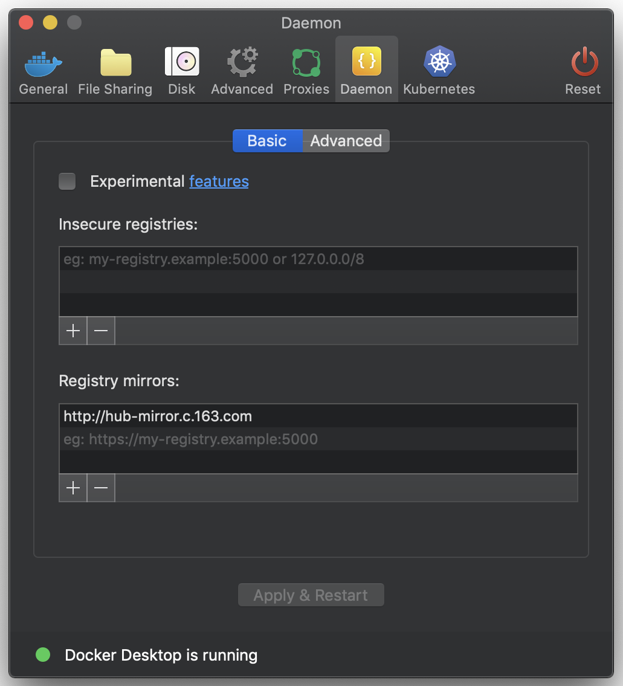

# Docker学习

[TOC]

------

## 安装

**操作系统：**macOS Mojave 10.14.6

通过Homebrew安装：`brew cask install docker`

### 镜像加速

- 使用网易的镜像
- Docker -> Perferences... -> Daemon -> Registry mirror -> Apply & Restart
- `docker info` 查看是否配置成功

------

