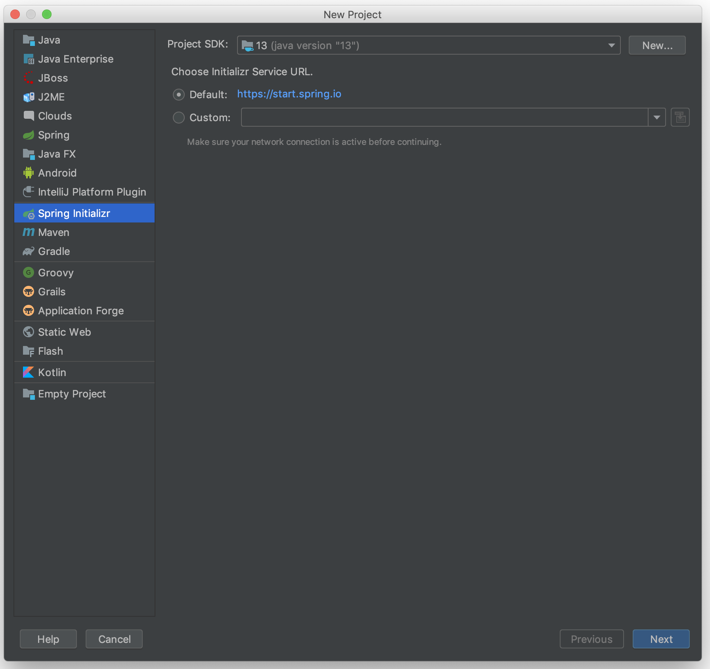
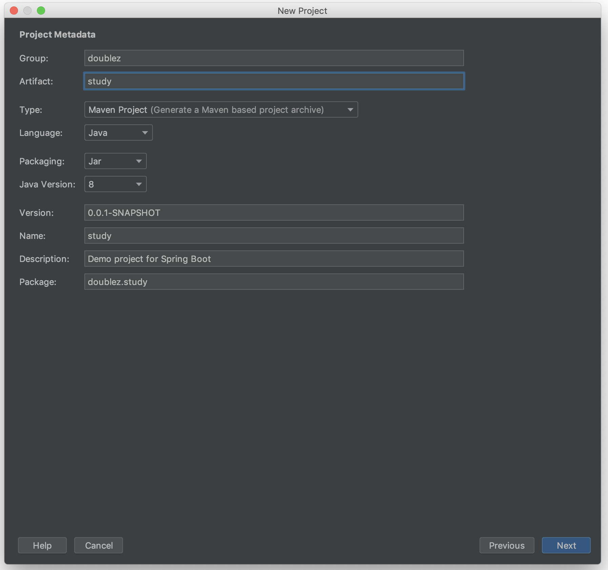
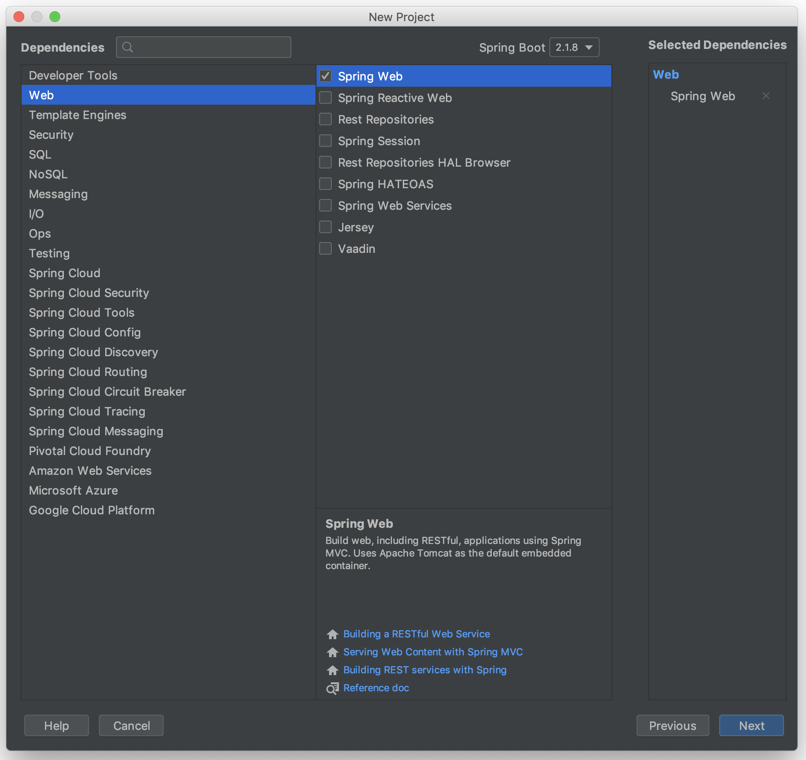
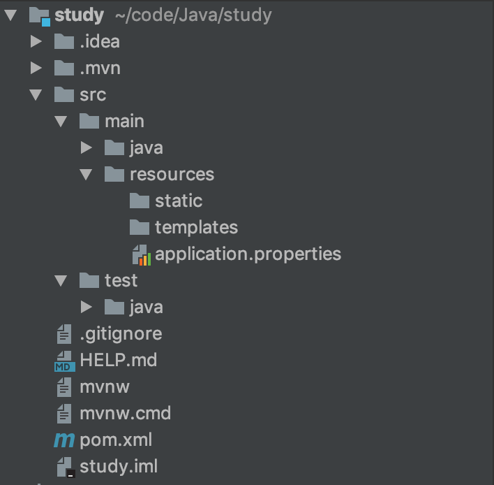
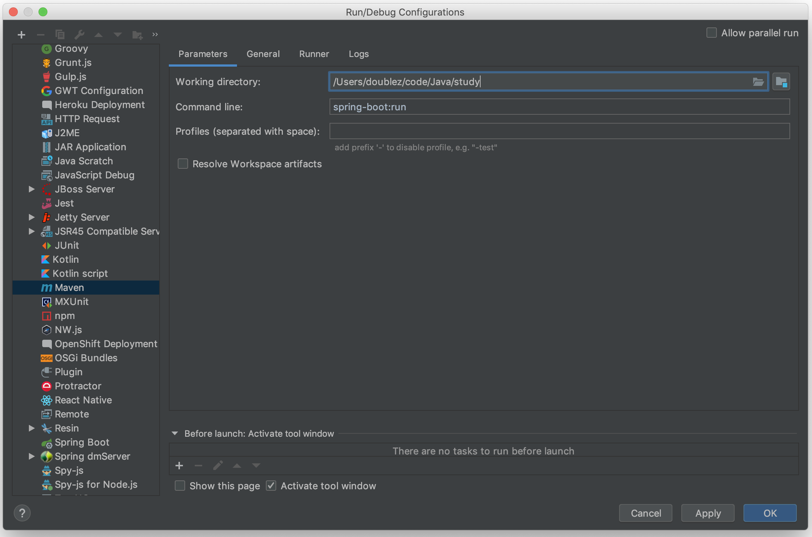
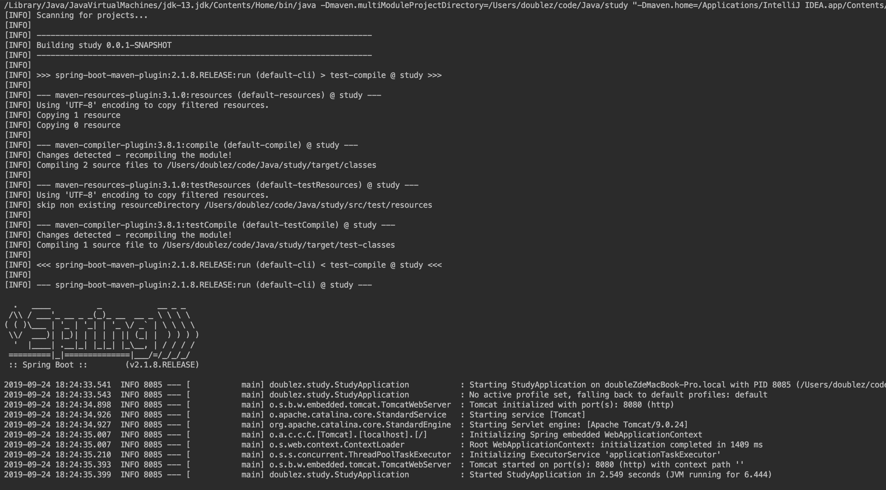
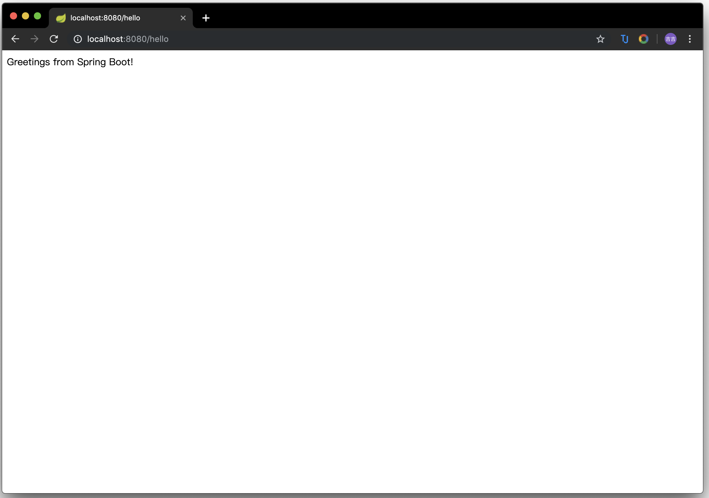

# SpringBoot学习

Table of Contents
=================

   * [SpringBoot学习](#springboot学习)
      * [创建SpringBoot工程](#创建springboot工程)
      * [项目结构](#项目结构)
      * [添加Controller](#添加controller)
      * [配置maven](#配置maven)
      * [运行SpringBoot](#运行springboot)

------

## 创建SpringBoot工程

- 创建Spring Initializer项目

  

- 填写group和artifact

  

- 开启web功能

  

------

## 项目结构

```
- src
	-main
		-java
			-package
				-SpringbootApplication		//程序的入口
		-resouces
			- statics						//静态资源
			- templates					//模板资源
			- application.yml		//配置文件
	-test
- pom					//基本的依赖管理文件
```



------

## 添加Controller

- 在java文件夹中新建Controller

  ```java
  package doublez.study;
  
  import org.springframework.web.bind.annotation.RestController;
  import org.springframework.web.bind.annotation.RequestMapping;
  
  @RestController
  public class HelloController {
  
      @RequestMapping("/hello")
      public String index() {
          return "Greetings from Spring Boot!";
      }
  
  }
  ```

------

## 配置maven

- Edit Configuration -> Add New Configuration -> Maven -> Apply -> OK
- Work directory设置为该项目的目录
- Commend Line为Spring-boot:run



------

## 运行SpringBoot





