# neo4j学习

Table of Contents
=================

   * [neo4j学习](#neo4j学习)
      * [简介](#简介)
      * [图形](#图形)
      * [图形数据库](#图形数据库)
      * [数据模型（属性图模型）](#数据模型属性图模型)
      * [环境搭建](#环境搭建)
      * [构建模块](#构建模块)
         * [节点](#节点)
         * [关系](#关系)
         * [属性](#属性)
         * [标签](#标签)
      * [CQL](#cql)
         * [命令](#命令)
            * [清空Neo4j数据库](#清空neo4j数据库)
         * [函数](#函数)
         * [数据类型](#数据类型)
         * [CREATE](#create)
         * [MATCH](#match)
         * [RETURN](#return)
         * [WHERE](#where)
         * [DELETE](#delete)
         * [REMOVE](#remove)
         * [SET](#set)
         * [ORDER BY](#order-by)
         * [UNION](#union)
         * [LIMIT](#limit)
         * [SKIP](#skip)
         * [MERGE](#merge)
         * [NULL值](#null值)
         * [IN](#in)

------

## 简介

开源图形数据库

- no-Schema
- no-SQL

------

## 图形

一组节点和连接这些节点的关系

- 属性用来表示数据，属性的格式是健值对

- 属性存在于<u>节点</u>和<u>关系</u>中

  

  <center>属性在节点中</center>

<center>属性在关系中</center>
------

## 图形数据库

以图形结构的形式存储数据的数据库，以节点、关系和属性的形式存储应用程序的数据

- RDBMS以表的行、列形式存储数据
- GDBMS以图形的形式存储数据

图形数据库主要用于存储更多的连接数据，如果用RDMMS数据库存储连接数据，它不能提供用于遍历大量数据的性能

------

## 数据模型（属性图模型）

- 节点和关系都包含属性
- **属性**是健值对
- **关系**
  - 关系连接节点
  - 关系具有方向：单向、双向
  - 每个关系包含<u>开始节点</u>和<u>结束节点</u>


------

## 环境搭建

**操作系统：**macOS Mojave 10.14.6

- 下载neo4j-community-3.4.15-unix.tar

- jdk版本jdk-8u221-macosx-x64

  > mac jdk版本切换
  >
  > ```shell
  > # 创建.bash_profile配置文件
  > vim ~/.bash_profile
  > 
  > # 设置jdk版本
  > export JAVA8_HOME=/Library/Java/JavaVirtualMachines/jdk1.8.0_221.jdk/Contents/Home
  > export JAVA_HOME=$JAVA8_HOME
  > 
  > # 动态切换JAVA_HOME的配置
  > alias jdk8='export JAVA_HOME=$JAVA8_HOME'
  > 
  > # 重新执行.bash_profile文件
  > source .bash_profile
  > ```
  >
  > 

- cd neo4j-community-3.4.15/

- cd bin/

- ./neo4j start

- 在浏览器中访问url: localhost:7474/

  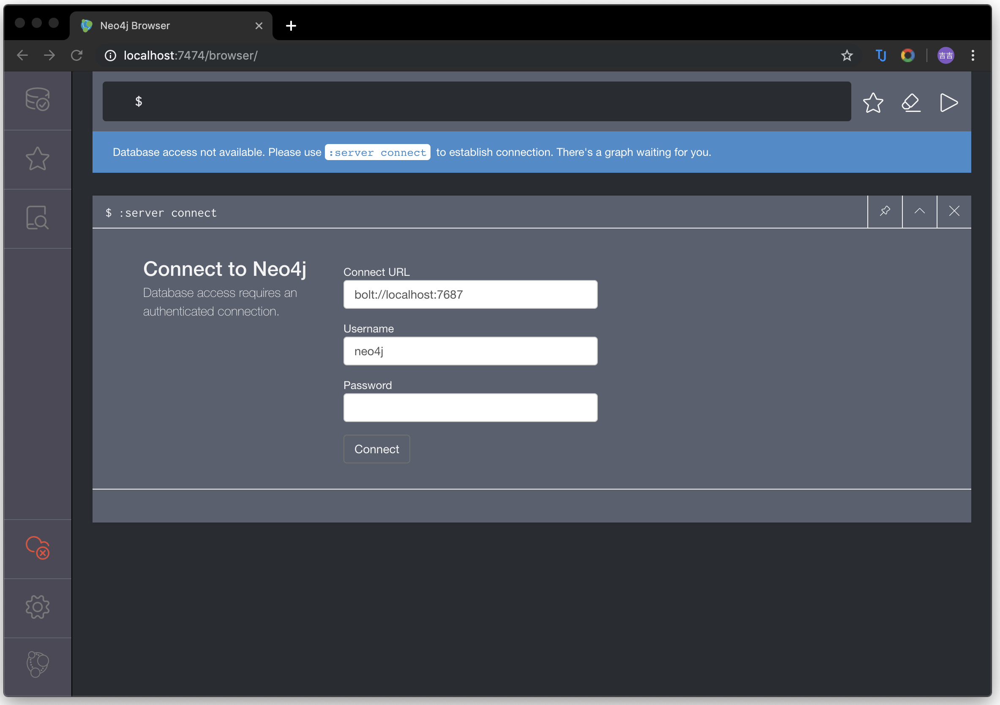
  
- ./neo4j stop

> 通过shell脚本快捷启动neo4j
>
> ```shell
> vim .bash_aliases
> alias neo4j='~/neo4j-community-3.4.15/bin/neo4j'
> source .bash_aliases
> ```

------

## 构建模块

### 节点

- 图表的基本单位
- 包含属性（键值对）


<center>Node Name = "Employee"</center>
------

### 关系

- 连接两个节点
- 包含起始节点和结束节点
- 也可以包含属性（键值对）


1. Emp是起始节点，Dept是结束节点
2. WORKS_FOR是节点之间的关系
3. 这个关系有一个属性ID=123
4. 箭头表示从Emp到Dept的关系

------

### 属性

- 键值对
- 用来描述节点和关系
- 格式：`Key = value`
  - Key是字符串
  - value可以是任何Neo4j数据类型
- **Neo4j将数据存储在属性中**

------

### 标签

- 将公共名称和一组节点或关系相关联
- 节点或关系可以包含一个或多个标签

------

## CQL

### 命令

| 命令     | 作用                     |
| -------- | ------------------------ |
| CREATE   | 创建节点、关系、属性     |
| MATCH    | 检索节点、关系、属性数据 |
| RETURN   | 返回查询结果             |
| WHERE    | 条件过滤                 |
| DELETE   | 删除节点和关系           |
| REMOVE   | 删除（节点和关系的）属性 |
| ORDER BY | 排序检索数据             |
| SET      | 添加/更新标签            |

#### 清空Neo4j数据库

match (n) detach delete n

------

### 函数

| 函数         | 作用                                   |
| ------------ | -------------------------------------- |
| String       | 使用String字面量                       |
| Aggregation  | 对CQL查询结果执行聚合操作              |
| Relationship | 获取关系的细节，如startnode，endnode等 |

------

### 数据类型

| 数据类型       | 描述              |
| -------------- | ----------------- |
| boolean        | 布尔：true，false |
| byte           | 8位整数           |
| short/int/long | 16/32/64位整数    |
| float/double   | 32/64位浮点数     |
| char           | 16位字符          |
| String         | 字符串            |

------

### CREATE

**创建节点**

```CQL
CREATE (
   <node-name>:<label-name>
   { 	
      <Property1-name>:<Property1-Value>	//属性是键值对
      ........
      <Propertyn-name>:<Propertyn-Value>
   }
)

//node-name: 节点，将节点详细信息存储在Database.As中，不能使用它访问节点的详细信息
//label-name: 标签，作为节点名称的别名，应该使用标签名访问节点的详细信息
```

**创建关系**

```CQL
MATCH (<node1-label-name>:<node1-name>),(<node2-label-name>:<node2-name>)
CREATE  
	(<node1-label-name>)-[<relationship-label-name>:<relationship-name>{<define-properties-list>}]->(<node2-label-name>)
RETURN <relationship-label-name>
```


- **创建节点**

  - 没有属性的节点

    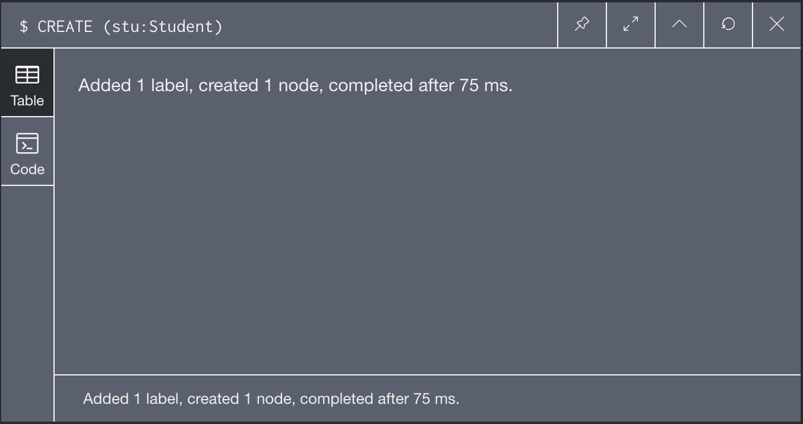

  - 有属性的节点

    

- **创建关系: **关系必须是定向的

  - 两个现有节点

  - 两个新节点

    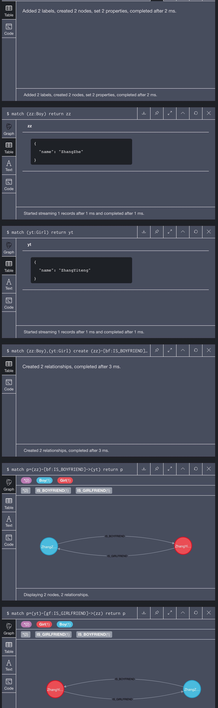

  - WHERE子句的两个退出节点

    -----

  - 无属性的关系

  - 有属性的关系


- **创建标签**

  - 为节点创建
  
  - 为关系创建
  
    -----
  
  - 单个标签
  
  - 多个标签
  
    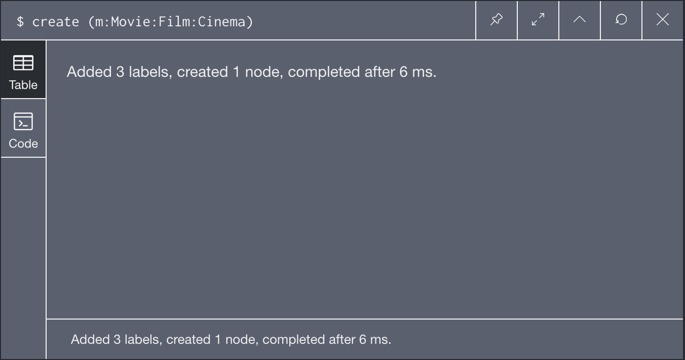

------

### MATCH

```CQL
MATCH (<node-name>:<label-name>)
```

- 获取有关节点和属性的数据
- 获取有关节点、关系和属性的数据


<u>*MATCH单独使用会引发InvalidSyntax错误*</u>

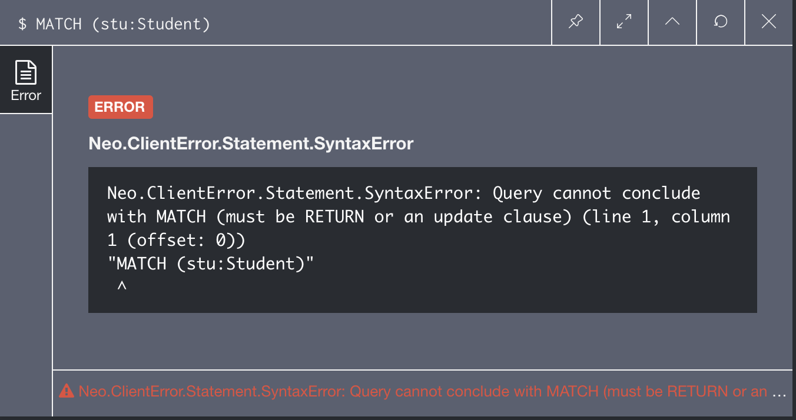

------

### RETURN

```CQL
RETURN 
   <node-name>.<property1-name>,
   ........
   <node-name>.<propertyn-name>
```

- 检索属性

  - 节点的某些属性

    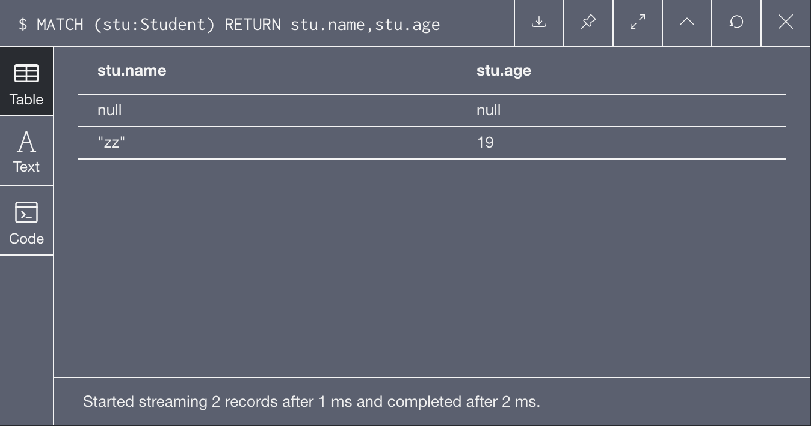

  - 节点的所有属性

    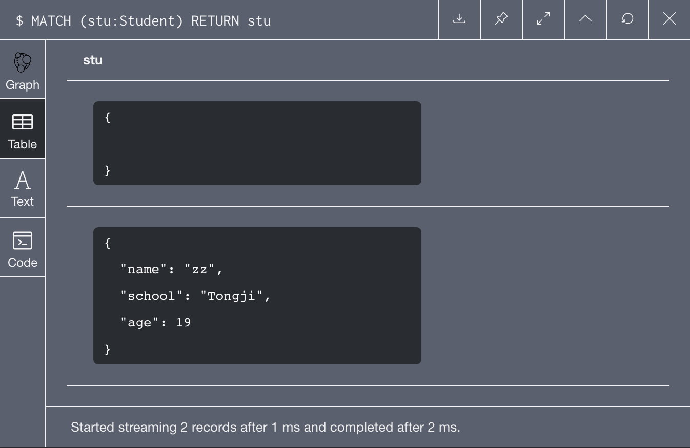

  - 节点和关联关系的某些关系

  - 节点和关联关系的所有关系

------

### WHERE

```CQL
WHERE <condition> <boolean-operator> <condition>
WHERE <property-name> <comparison-operator> <value>
```

| 逻辑运算符 | 比较运算符 |
| ---------- | ---------- |
| AND        | =          |
| OR         | <>         |
| NOT        | <          |
| XOR        | >          |
|            | <=         |
|            | >=         |

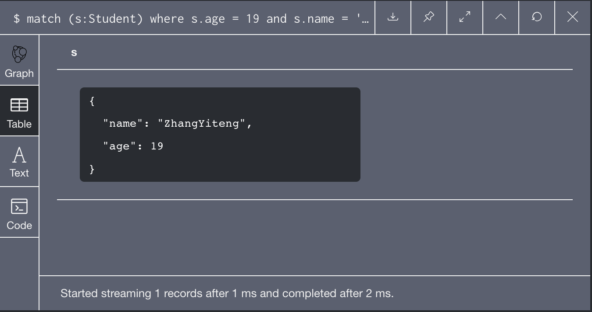

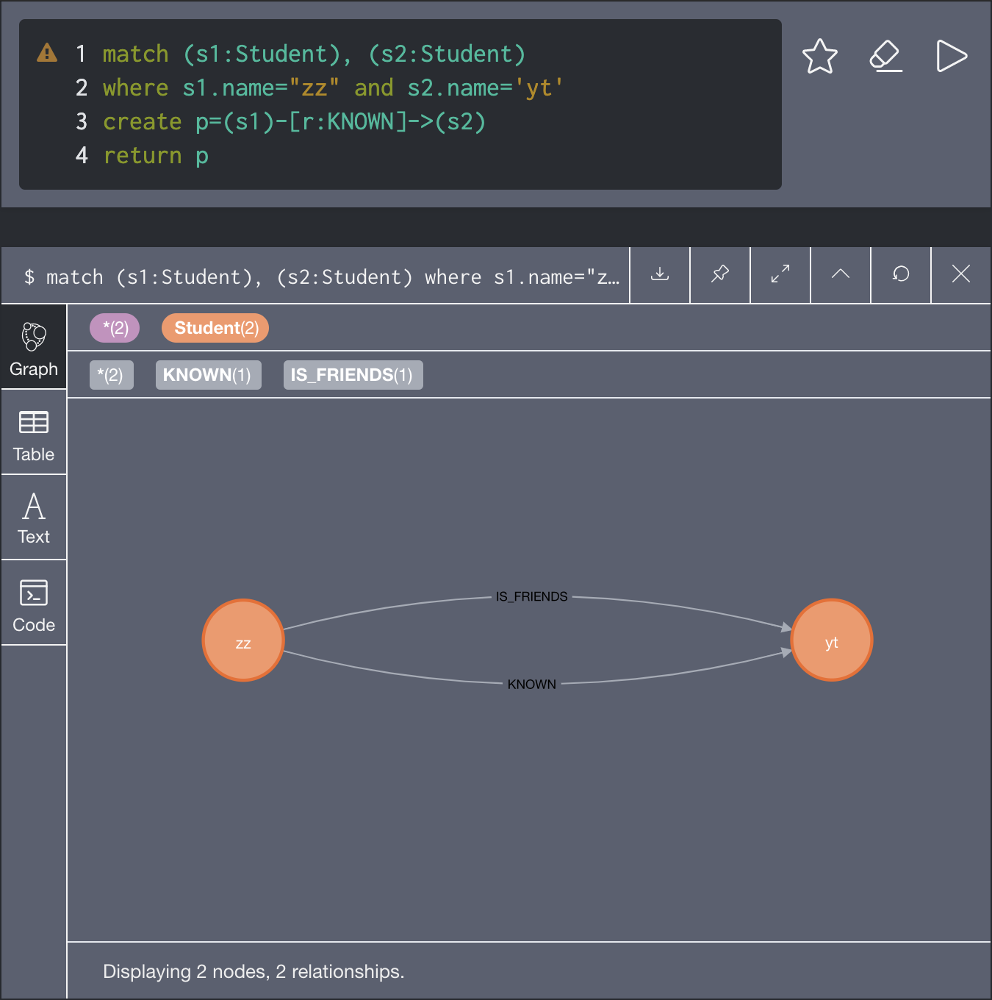

------

### DELETE

- 删除节点
- 删除节点及相关节点和关系

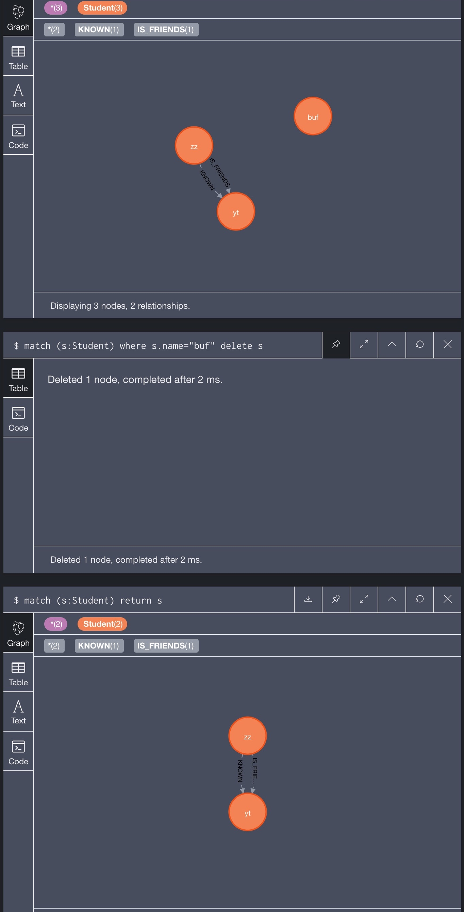

<center>删除某个节点</center>
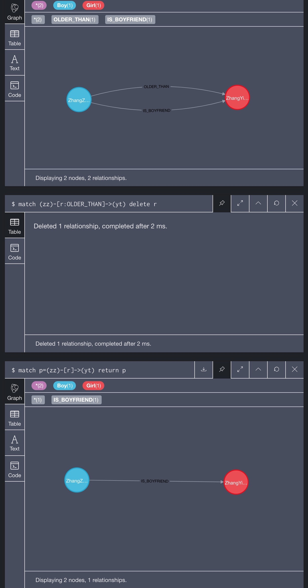

<center>删除节点间的某个属性</center>
------

### REMOVE

- 删除标签

  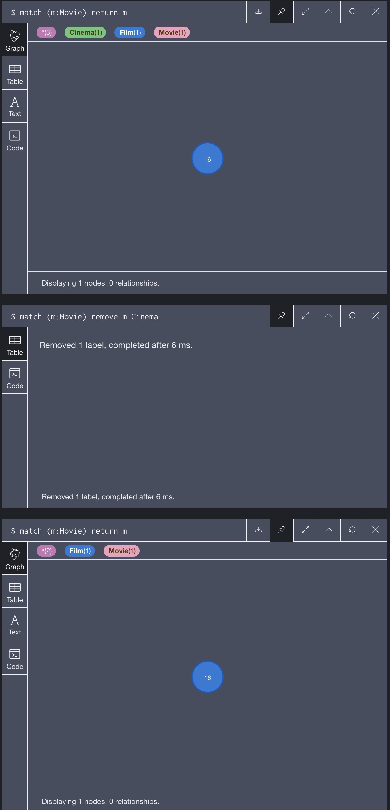

- 删除属性

  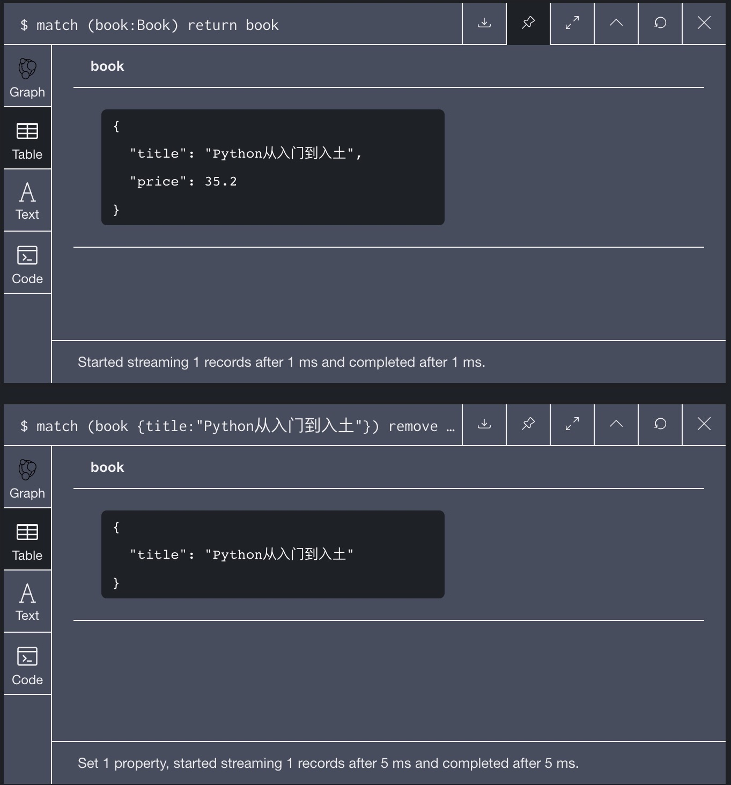

------

### SET

- 添加属性

  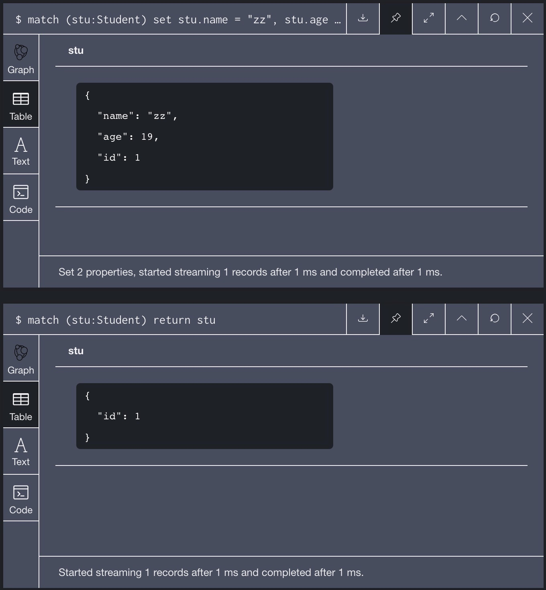

- 更新属性

  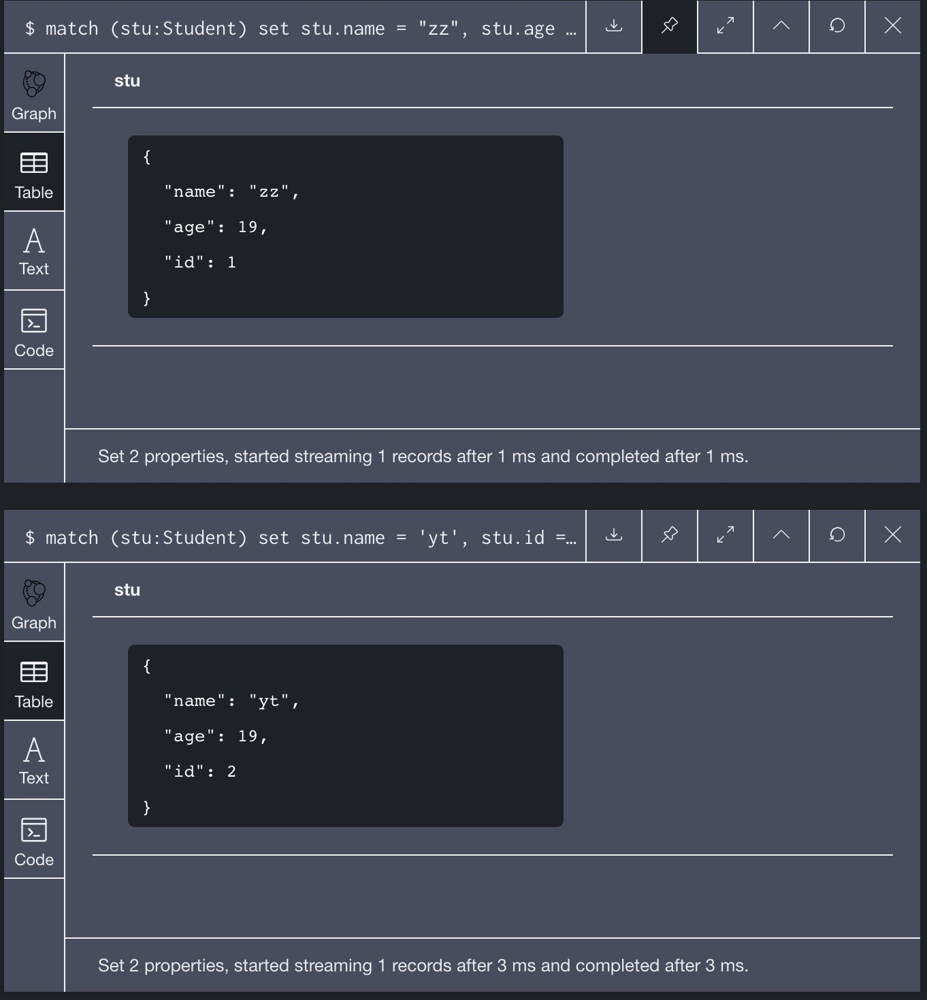

------

### ORDER BY

```CQL
MATCH...
RETURN...
ORDER BY XXX 				//默认升序排列
ORDER BY XXX DESC		//降序
```

------

### UNION

- 将结果中的公共行组合并返回（不返回重复的行）

  - 想要保留重复行：UNION ALL

- <u>列名称</u>和<u>列数据类型</u>必须相同

  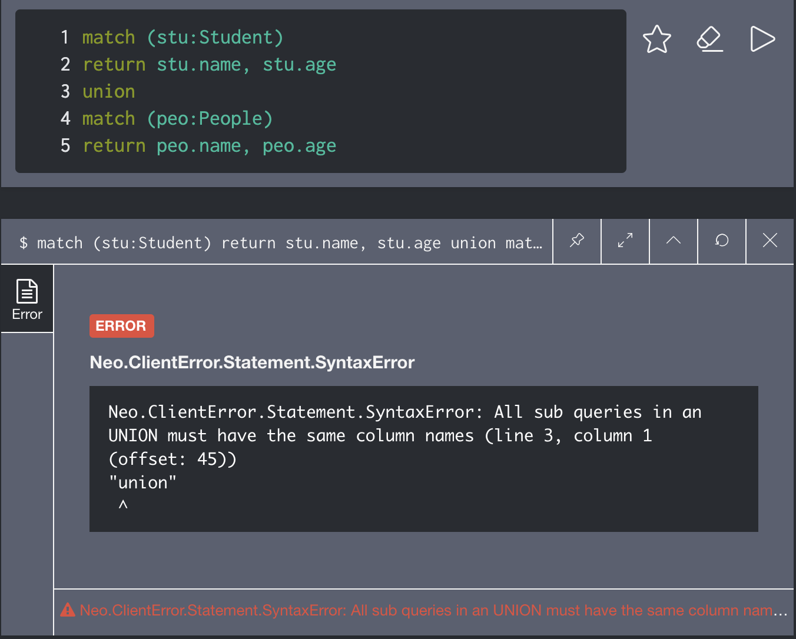

  <center>虽然有相同的属性名，但是节点名不同</center>


<center>union</center>
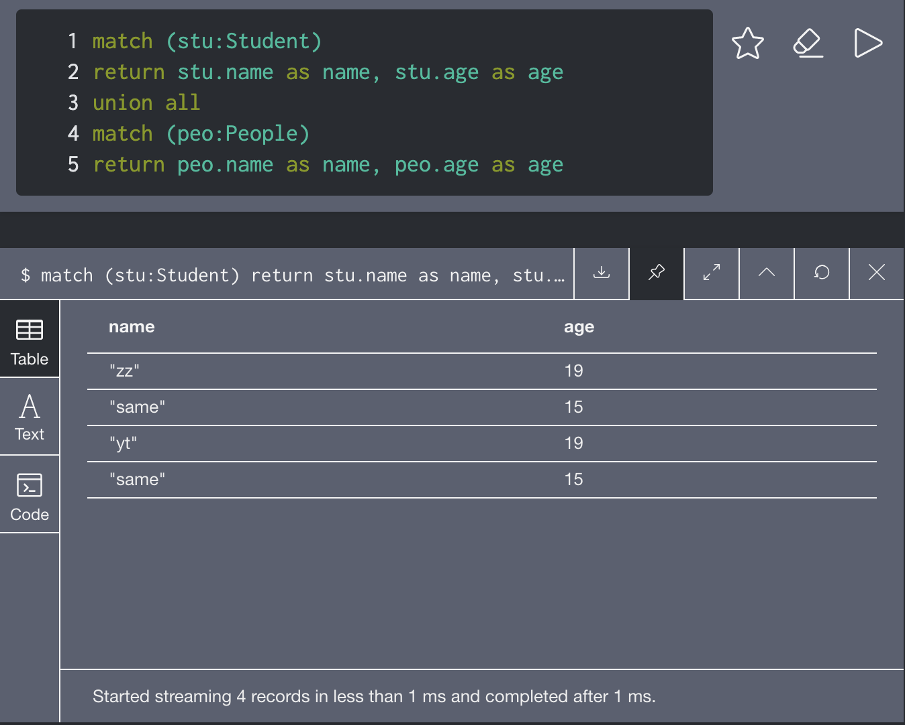

<center>union all</center>
------

### LIMIT

- 过滤或限制查询返回的行数
- 修建结果集底部的结果（把底部多的去掉）

### SKIP

- 修建结果集顶部的结果

```CQL
MATCH...
RETURN
LIMIT 25
SKIP 25
```

------

### MERGE

- MERGE = CREATE + MATCH

  - 在图中搜索，如果存在，则返回结果
  - 不存在，创建新的节点/关系并返回

  > CREATE 总是向数据库中添加新的节点，如果信息一模一样也会插入

------

### NULL值

- 创建现有节点标签名单未指定属性值的节点时，将创建一个具有NULL值的新节点

```CQL
//过滤NULL值
MATCH (e:E)
WHERE e IS NOT NULL
```

------

### IN

```CQL
//过滤在范围中的节点
WHERE e.value in [5,10]
```

------

### 